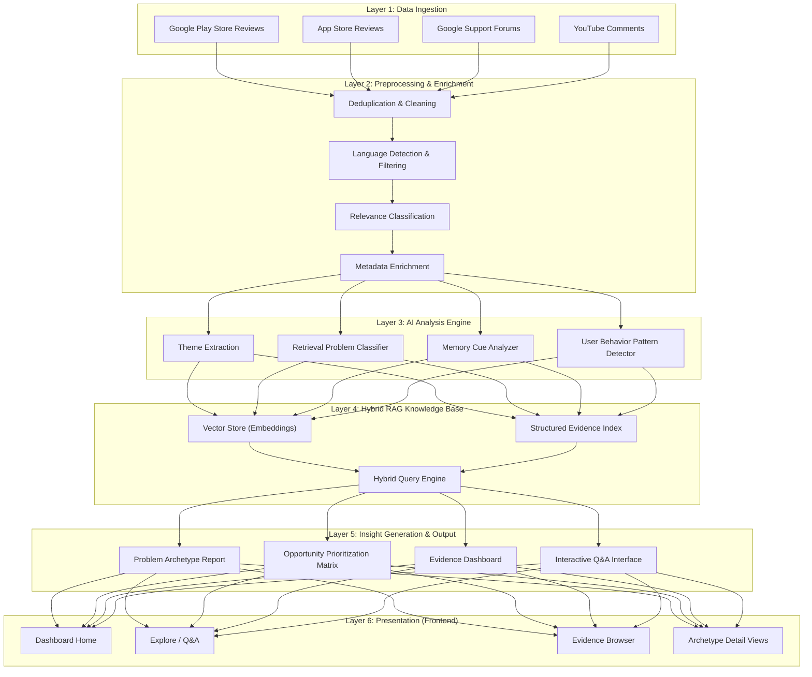
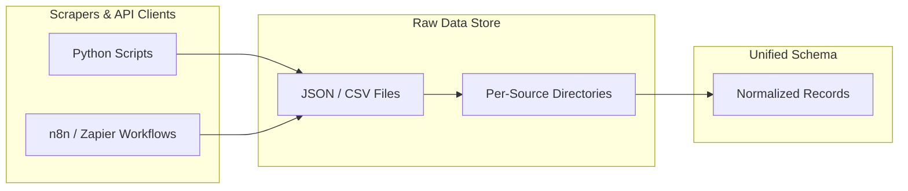
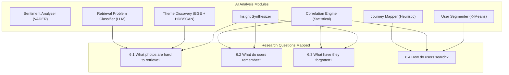
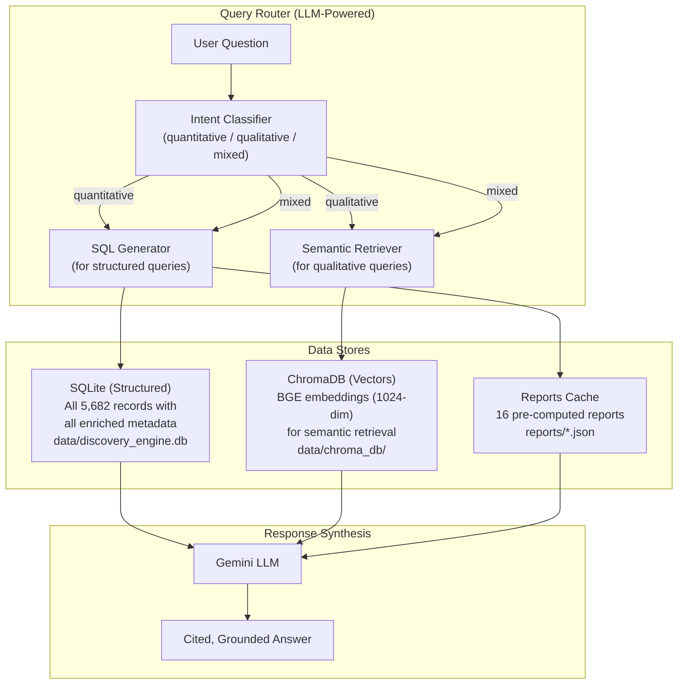
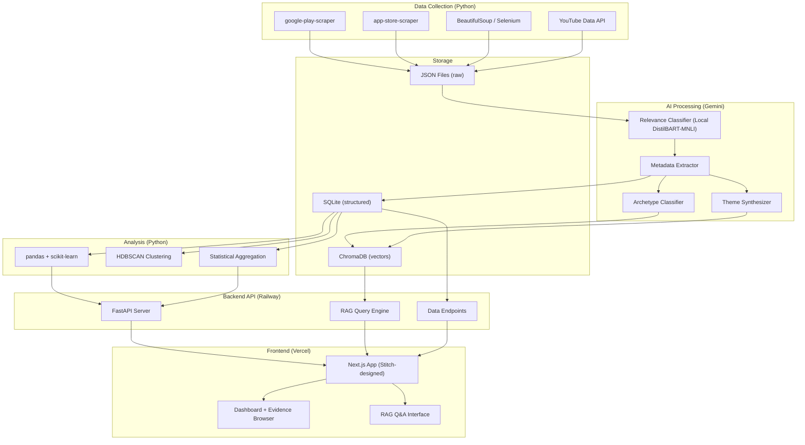
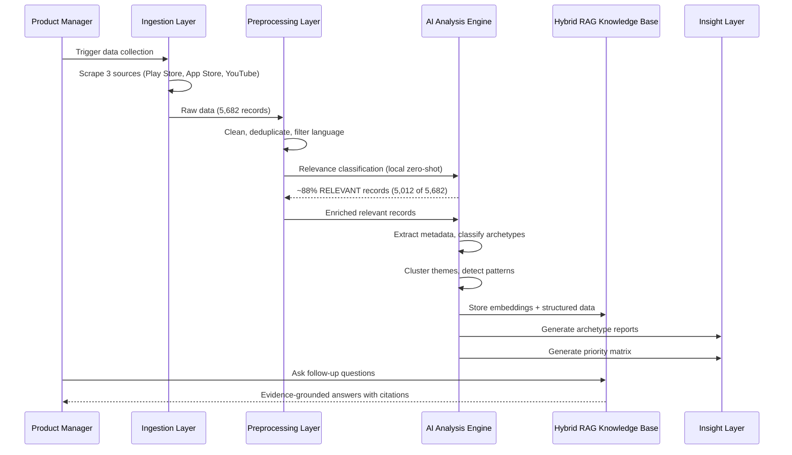
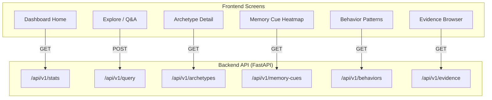
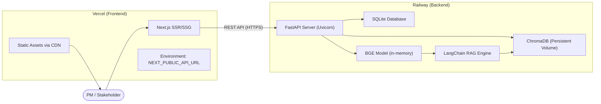

# Architecture Plan: AI-Powered Photo Retrieval Discovery Engine

> **Reference**: This architecture is designed to fulfill every requirement outlined in [`problemstatement.md`](file:///Users/shree/Desktop/Next%20Leap%20Prodman/Final%20project%20-%20Google%20photos/google%20Photos%20retrieval%20engine/problemstatement.md).

---

## 1. Architecture Overview

### 1.1 High-Level System Design

The Discovery Engine is a **multi-stage data pipeline** that ingests raw user feedback from public sources, processes it through AI-powered analysis layers, and produces structured, evidence-grounded insights about photo retrieval failures.



### 1.2 Design Principles

| Principle | Rationale |
|---|---|
| **Evidence-first** | Every insight must trace back to real user quotes / data |
| **Modular pipeline** | Each layer operates independently; sources can be added without re-architecting |
| **Scale-ready** | System handles thousands of data points across 5+ source types |
| **Beyond sentiment** | Analysis layers are designed for behavioral pattern extraction, not just polarity scoring |
| **Queryable output** | RAG layer enables ad-hoc product questions against the evidence base |

---

## 2. Layer 1 — Data Ingestion Pipeline

### 2.1 Source-by-Source Collection Strategy

| # | Source | Collection Method | Actual Volume | Key Fields Extracted |
|---|---|---|---|---|
| 1 | **Google Play Store** | Web scraping (`google-play-scraper`) | 1,858 reviews | Rating, text, date, version, thumbs-up count |
| 2 | **Apple App Store** | Web scraping (`app-store-scraper`) | 834 reviews | Rating, text, date, version |
| 3 | **YouTube Comments** | YouTube Data API v3 | 880 comments | Comment text, likes, video title/topic |

> [!NOTE]
> **Data sources actually ingested**: Reddit, Google Support Forums, and social media scrapers were planned but not implemented due to API access restrictions and scope prioritization. The 3 active sources yielded 5,682 records after normalization — sufficient for robust analysis across all 8 archetypes.

### 2.2 Ingestion Architecture



### 2.3 Unified Data Schema

Every ingested record — regardless of source — is normalized to this schema:

```json
{
  "id": "uuid-v4",
  "source": "play_store | app_store | youtube",
  "source_url": "https://...",
  "raw_text": "Original user text...",
  "cleaned_text": "Preprocessed text...",
  "date": "2025-08-15",
  "rating": 3,
  "engagement_score": 42,
  "language": "en",
  "metadata": {
    "app_version": "6.82",
    "video_title": "..."
  }
}
```

### 2.4 Data Quality Gates

| Gate | Rule | Action on Failure |
|---|---|---|
| **Language** | Must be English (or translatable) | Filter out or translate |
| **Minimum length** | ≥ 15 words | Discard (too short for analysis) |
| **Relevance** | Must mention Google Photos or photo retrieval/search | Move to `excluded/` for audit |
| **Deduplication** | Fuzzy match (≥ 90% similarity) across sources | Keep highest-engagement version |
| **Recency** | Prefer last 3 years; flag older content | Tag as `legacy` but retain |

---

## 3. Layer 2 — Preprocessing & Enrichment

### 3.1 Text Cleaning Pipeline

```
Raw Text
  → Remove HTML/markdown artifacts
  → Normalize Unicode, emojis → text
  → Fix common abbreviations (e.g., "bc" → "because", "ngl" → "not gonna lie")
  → Sentence segmentation
  → Cleaned Text
```

### 3.2 Relevance Classification (Local Zero-Shot Model)

Not all reviews/posts discuss photo retrieval. A first-pass **local zero-shot classifier** (`valhalla/distilbart-mnli-12-1`) filters for relevance — entirely on-device, with zero API calls:

```
Classification Strategy (HuggingFace Zero-Shot):
┌─────────────────────────────────────────────────────────┐
│ Model: valhalla/distilbart-mnli-12-1                     │
│ Candidate Labels:                                       │
│  1. "searching for, finding, or retrieving photos"      │
│  2. "general complaint about storage, billing,          │
│      syncing, sharing, or UI design"                    │
│                                                         │
│ Thresholds:                                             │
│  - P(retrieval) ≥ 0.65 → RELEVANT                      │
│  - P(retrieval) ≥ 0.45 → PARTIALLY_RELEVANT             │
│  - P(retrieval) < 0.45 → NOT_RELEVANT                   │
└─────────────────────────────────────────────────────────┘
```

> **Why local instead of LLM API?** The relevance classification task is a simple binary/ternary filter — "is this about photo retrieval?" — which doesn't require the deep reasoning capabilities of a cloud LLM. A local zero-shot model is free, has no rate limits, processes the full corpus in ~10–15 minutes, and is more than accurate enough (~90%+) for this filtering step. LLM API calls (Gemini for extraction, Gemini for synthesis) are reserved for later phases (metadata enrichment, archetype classification, theme synthesis) where nuanced reasoning genuinely matters.

**Expected filter rate**: ~60–70% of raw data filtered as NOT_RELEVANT, leaving a focused corpus of retrieval-specific feedback.

### 3.3 Metadata Enrichment

Each relevant record is enriched with AI-extracted metadata:

| Enrichment Field | Description | Method |
|---|---|---|
| `photo_category` | Type of photo discussed (travel, medical, document, people, event, etc.) | LLM extraction |
| `memory_cues_mentioned` | What the user remembers (person, place, time, emotion, activity) | LLM extraction |
| `memory_gaps_mentioned` | What the user has forgotten (date, location, album, keyword) | LLM extraction |
| `search_strategy_used` | How the user tried to find it (keyword search, scrolling, asking someone) | LLM extraction |
| `frustration_level` | Low / Medium / High / Extreme | LLM + sentiment heuristic |
| `outcome` | Found / Not Found / Gave Up / Used Workaround | LLM extraction |

---

## 4. Layer 3 — AI Analysis Engine

This is the core analytical layer that transforms enriched data into structured insights. It directly addresses the four guiding research questions from the problem statement.

### 4.1 Module Map



### 4.2 Theme Extraction Engine

**Purpose**: Discover emergent themes and retrieval problem categories from the corpus without pre-defining them.

**Method**:
1. Generate embeddings for all enriched records using an embedding model (e.g., `text-embedding-3-small`).
2. Cluster embeddings using HDBSCAN or K-Means.
3. Use LLM to name and describe each cluster.
4. Human-in-the-loop validation: review and merge/split clusters.

**Expected output**:
```
Theme Cluster: "Travel Photo Retrieval"
  - Size: 342 records (18% of corpus)
  - Core pattern: Users remember the trip but not specific dates/locations
  - Top memory cues: destination name, travel companion, season
  - Top memory gaps: exact date, restaurant/hotel name, album
  - Frustration level: High (72% of records)
```

### 4.3 Retrieval Problem Classifier

**Purpose**: Classify each record into a **retrieval problem archetype** — a reusable taxonomy of *why* retrieval fails.

**Proposed Taxonomy** (to be refined by data):

| Archetype | Description | Example |
|---|---|---|
| `TEMPORAL_DECAY` | User remembers the event but not when it happened | "I know I took it but can't remember if it was 2022 or 2023" |
| `SPATIAL_AMBIGUITY` | User remembers a place vaguely but not precisely | "That café somewhere in Goa" |
| `KEYWORD_MISMATCH` | User's search terms don't match how the system indexed it | "I searched 'medicine' but it's labeled as 'pill bottle'" |
| `CONTEXT_WITHOUT_CONTENT` | User remembers the context but not the photo itself | "I was sick last year, I took a photo of something" |
| `PEOPLE_WITHOUT_NAMES` | User remembers people in a photo but not tagged/identified | "My college friend — I don't remember their last name" |
| `VISUAL_MEMORY_ONLY` | User remembers what the photo looked like but not metadata | "A blue building with a red door" |
| `ALBUM_FRAGMENTATION` | Photo is lost across albums, shared libraries, or archives | "I think it might be in my wife's shared album?" |
| `VOLUME_OVERWHELM` | Too many photos to scroll through manually | "I have 50,000 photos, I can't just scroll" |

**Classification approach**: Multi-label LLM classification with confidence scores. Each record can belong to multiple archetypes.

### 4.4 Memory Cue Analyzer

**Purpose**: Build a quantitative model of **what information users actually retain** about old photos.

**Dimensions analyzed**:

```
Memory Cue Taxonomy:
├── Temporal     → Season, year, relative time ("last summer"), event-anchored ("during Diwali")
├── Spatial      → City/country, venue type ("a café"), relative ("near the beach")
├── People       → Named person, relationship ("my sister"), group ("college friends")
├── Emotional    → Mood ("happy trip"), occasion ("birthday"), milestone ("graduation")
├── Visual       → Colors, objects, scene composition ("sunset", "blue building")
├── Activity     → What was happening ("cooking", "hiking", "eating")
└── Content Type → Photo category ("screenshot", "document", "selfie", "landscape")
```

**Output**: A **Memory Cue Frequency Matrix** showing which cues are most/least commonly retained, cross-tabulated by photo category.

### 4.5 Search Behavior Pattern Detector

**Purpose**: Understand **how users actually attempt retrieval** when memory is fuzzy.

**Behavior patterns to detect**:

| Pattern | Description |
|---|---|
| **Keyword guessing** | User tries multiple keyword variations |
| **Timeline scrolling** | User scrolls through chronological feed hoping to recognize it |
| **Album browsing** | User navigates through albums/folders |
| **People-based search** | User searches by person/face |
| **Location-based search** | User searches by place or map |
| **Social delegation** | User asks someone else "Do you have that photo?" |
| **Give-up** | User abandons the search entirely |
| **Workaround** | User uses an external tool or manual method |

---

## 5. Layer 4 — Hybrid RAG Knowledge Base

### 5.1 Purpose

The RAG layer transforms the analyzed corpus into a **queryable knowledge base** that a PM can interrogate with natural language questions — going far beyond static reports. Critically, it must handle **both qualitative and quantitative queries**:

| Query Type | Example | Limitation of Standard RAG |
|---|---|---|
| **Quantitative** | "How many total comments are there?" | Vector search retrieves similar docs, not counts |
| **Aggregation** | "How many negative comments mention album issues?" | Can't do GROUP BY or COUNT on embeddings |
| **Qualitative** | "What do users say about finding travel photos?" | ✅ Standard RAG handles this well |
| **Mixed** | "What are the top 3 problems with counts and examples?" | Needs both structured data and semantic retrieval |

> [!IMPORTANT]
> A standard semantic-only RAG **cannot answer counting or aggregation questions**. When a PM asks "how many comments are about keyword mismatch?", vector similarity returns *similar* documents but has no way to produce an accurate count. The solution is a **dual-store architecture** with an intelligent query router.

### 5.2 Hybrid RAG Architecture



### 5.3 Dual-Store Design

#### 5.3.1 Structured Store (SQLite)

All enriched records are loaded into a normalized SQLite database to support fast SQL-style queries:

| Table | Purpose | Key Columns |
|---|---|---|
| `feedback` | Core records | `id`, `source`, `rating`, `date`, `cleaned_text`, `word_count` |
| `metadata` | Enriched fields | `feedback_id`, `photo_category`, `frustration_level`, `outcome`, `search_strategy`, `memory_cues`, `memory_gaps` |
| `archetypes` | Classification | `feedback_id`, `archetype`, `confidence` |
| `sentiment` | Sentiment scores | `feedback_id`, `polarity`, `label`, `urgency`, `effort` |
| `journey` | Journey mapping | `feedback_id`, `primary_stage`, `journey_depth`, `retry_count` |
| `themes` | Emergent themes | `feedback_id`, `cluster_id`, `theme_label` |
| `segments` | User segments | `feedback_id`, `segment_id`, `persona_label` |

**Quantitative queries this enables:**
- `SELECT COUNT(*) FROM feedback` → "How many total comments?"
- `SELECT COUNT(*) FROM sentiment WHERE label = 'negative'` → "How many negative comments?"
- `SELECT archetype, COUNT(*) FROM archetypes GROUP BY archetype ORDER BY COUNT(*) DESC` → "Which archetype has the most feedback?"
- `SELECT source, AVG(polarity) FROM feedback JOIN sentiment ... GROUP BY source` → "Which source has the most negative sentiment?"

#### 5.3.2 Semantic Store (ChromaDB)

Vector embeddings for semantic similarity search, using the existing BGE embeddings:

| Component | Choice | Rationale |
|---|---|---|
| **Embedding model** | `BAAI/bge-large-en-v1.5` (1024-dim) | Already computed and cached from theme discovery |
| **Vector database** | ChromaDB (local, persistent) | Simple, no infrastructure needed |
| **Chunk strategy** | Tiered (short→composite, standard→1:1, long→split, summaries→dedicated) | Adapts to actual data profile |
| **Metadata filters** | Source, archetype, frustration, photo category, sentiment label, journey stage | Enables hybrid semantic + structured queries |

#### 5.3.3 Reports Cache

Pre-computed analysis reports (`reports/*.json`) are loaded as context for complex questions that require already-computed statistics (e.g., factor importance rankings, correlation matrices, segment profiles).

### 5.4 Query Router

The Query Router is the brain of the hybrid system. It classifies each incoming question and routes it to the appropriate data store(s):

```
User Question
    │
    ▼
┌─────────────────────────────────┐
│  LLM Intent Classifier          │
│  (Gemini Flash — fast, cheap)   │
│                                 │
│  Outputs:                       │
│   • query_type: quantitative    │
│               | qualitative     │
│               | mixed           │
│   • sql_hint: suggested filter  │
│   • search_hint: semantic query │
└─────────────────────────────────┘
    │
    ├── quantitative ──→ SQL query on SQLite ──→ numbers + counts
    ├── qualitative  ──→ BGE search on ChromaDB ──→ relevant quotes
    └── mixed        ──→ SQL (counts) + ChromaDB (examples) ──→ both
    │
    ▼
┌─────────────────────────────────┐
│  Gemini Synthesis LLM           │
│  Combines numbers + quotes      │
│  into a grounded, cited answer  │
└─────────────────────────────────┘
```

### 5.5 Example Hybrid RAG Queries

| PM Question | Router Decision | What Happens |
|---|---|---|
| *"How many total comments are there?"* | **Quantitative** | `SELECT COUNT(*) FROM feedback` → "There are 5,682 total feedback records." |
| *"How many negative comments?"* | **Quantitative** | `SELECT COUNT(*) FROM sentiment WHERE label = 'negative'` → exact count |
| *"How many comments are about KEYWORD_MISMATCH?"* | **Quantitative** | `SELECT COUNT(*) FROM archetypes WHERE archetype = 'KEYWORD_MISMATCH'` → "217 comments" |
| *"What do users say about forgetting dates?"* | **Qualitative** | Semantic search → top 10 quotes about temporal decay with citations |
| *"What are the top 3 problems with counts and examples?"* | **Mixed** | SQL aggregation for counts + ChromaDB retrieval for representative quotes |
| *"Which source has the most frustrated users?"* | **Quantitative** | `SELECT source, COUNT(*) FROM ... WHERE frustration_level = 'high' GROUP BY source` |
| *"Show me the user journey breakdown"* | **Quantitative** | Load `reports/journey_report.json` → formatted summary |

---

## 6. Layer 5 — Insight Generation & Output

### 6.1 Output Artifacts

The engine produces four key deliverables:

#### 6.1.1 Retrieval Problem Archetype Report

A structured report profiling each retrieval failure archetype:

```
┌──────────────────────────────────────────────────────┐
│ ARCHETYPE: Temporal Decay                            │
│ Frequency: 28% of retrieval complaints              │
│ Severity: HIGH (avg frustration 4.2/5)               │
│ Most affected categories: Travel, Medical, Events    │
│                                                      │
│ Pattern: Users remember the event but not the date.  │
│ They try scrolling or guessing years. Most give up   │
│ after 5–10 minutes.                                  │
│                                                      │
│ Evidence:                                            │
│ • "I know I took it in Goa but was it 2022 or 2023?" │
│   — Support Forum, 2025-01-18                        │
│ • "Spent 20 min scrolling. Never found it."          │
│   — Play Store, ★★☆☆☆, 2025-03-12                   │
│ • [12 more citations...]                             │
│                                                      │
│ Opportunity Signal: STRONG                           │
└──────────────────────────────────────────────────────┘
```

#### 6.1.2 Opportunity Prioritization Matrix

**Opportunity Score (0–10) = (Frequency Index × 0.4) + (Severity Index × 0.4) + (Feasibility × 0.2)**, where Frequency Index = frequency % ÷ highest archetype frequency % × 10 and Severity Index = avg severity (1–4) ÷ 4 × 10.

| Archetype | Frequency | Severity | Feasibility (0–10) | **Priority Score** |
|---|---|---|---|---|
| Album Fragmentation | 11.21% (637) | High (2.7) | 6.0 | **🔴 P0 (7.90)** |
| Volume Overwhelm | 8.98% (510) | High (2.8) | 5.0 | **🟡 P1 (7.00)** |
| Keyword Mismatch | 3.85% (219) | High (2.8) | 8.0 | **🟡 P1 (5.77)** |
| People Without Names | 3.36% (191) | High (2.6) | 9.0 | **🟢 P2 (5.60)** |
| Temporal Decay | 3.71% (211) | High (2.7) | 7.5 | **🟢 P2 (5.52)** |
| Spatial Ambiguity | 0.67% (38) | High (2.6) | 8.5 | **🟢 P2 (4.54)** |
| Context Without Content | 0.14% (8) | High (2.5) | 7.0 | **🟢 P3 (3.95)** |
| Visual Memory Only | 0.39% (22) | Medium (2.0) | 4.0 | **🟢 P3 (2.94)** |

#### 6.1.3 Memory Cue Frequency Dashboard

A visual/tabular summary of what users remember vs. forget, cross-cut by photo category.

#### 6.1.4 Interactive Q&A Interface

A conversational RAG interface allowing the PM to ask follow-up questions against the evidence base in real-time.

---

## 7. Technology Stack

### 7.1 Final Stack Selection

| Layer | Technology | Purpose |
|---|---|---|
| **Orchestration** | Python + n8n (optional) | Pipeline coordination, scheduling |
| **Scraping** | Python (BeautifulSoup, Selenium, google-play-scraper) | Data collection from public sources |
| **LLM (Extraction & Routing)** | Google Gemini (`gemini-3.5-flash-lite`) | Metadata enrichment, archetype classification, and intent routing |
| **LLM (Synthesis)** | Google Gemini (`gemini-3.5-flash-lite`) | Theme synthesis, report generation, RAG synthesis |
| **Zero-Shot Classifier** | HuggingFace (`valhalla/distilbart-mnli-12-1`) | Local relevance classification (Phase 3) |
| **Embeddings** | BGE (`BAAI/bge-large-en-v1.5`) | Vectorization for RAG |
| **Vector Store** | ChromaDB (persistent) | Semantic search and retrieval |
| **Data Storage** | JSON files + SQLite | Raw data + structured metadata |
| **Analysis** | Python (pandas, scikit-learn, HDBSCAN) | Clustering, statistics, aggregation |
| **Visualization** | Python (plotly) + React (react-plotly.js) | Interactive charts in frontend |
| **RAG Framework** | LangChain + Gemini/Gemini | Query engine over vector store |
| **Backend API** | FastAPI + Uvicorn | REST API serving insights & RAG queries to frontend |
| **Frontend Framework** | Next.js 14+ (React, App Router) | Google Photos-style evidence dashboard |
| **UI Design Tool** | Google Stitch (MCP) | AI-powered screen design & component generation |
| **Frontend Hosting** | Vercel | Edge deployment, automatic CI/CD from Git |
| **Backend Hosting** | Railway | Python backend with persistent volumes for ChromaDB + SQLite |

### 7.2 Architecture Diagram — Technology Mapping



---

## 8. Pipeline Execution Flow

### 8.1 End-to-End Workflow



### 8.2 Estimated Processing Timeline

| Phase | Duration | Parallel? |
|---|---|---|
| Data Ingestion (all sources) | 2–4 hours | Yes (per source) |
| Preprocessing & Cleaning | 1–2 hours | Yes (batch) |
| Relevance Classification | 10–15 min | No (local model, single pass) |
| Metadata Enrichment | 3–5 hours | Yes (batched LLM calls) |
| Theme Clustering | 1–2 hours | No |
| Archetype Classification | 2–3 hours | Yes (batched LLM calls) |
| Report Generation | 1–2 hours | No |
| **Total (with parallelism)** | **~8–12 hours** | — |

---

## 9. Directory Structure

```
google Photos retrieval engine/
├── Docs/
│   ├── problemstatement.md
│   ├── architectureplan.md
│   └── implementationplan.md
├── data/
│   ├── raw/                        # Raw scraped data per source
│   │   ├── play_store/
│   │   ├── app_store/
│   │   ├── support_forums/
│   │   ├── youtube/
│   ├── processed/                  # Cleaned, deduplicated, filtered
│   │   ├── relevant/               # Passed relevance filter
│   │   └── excluded/               # Failed relevance filter (audit trail)
│   └── enriched/                   # AI-enriched with metadata
├── src/
│   ├── ingestion/                  # Scraper scripts per source
│   │   ├── play_store_scraper.py
│   │   ├── youtube_scraper.py
│   │   └── ...
│   ├── preprocessing/              # Cleaning, dedup, relevance
│   │   ├── cleaner.py
│   │   ├── deduplicator.py
│   │   └── relevance_classifier.py
│   ├── analysis/                   # AI analysis modules
│   │   ├── theme_extractor.py
│   │   ├── archetype_classifier.py
│   │   ├── memory_cue_analyzer.py
│   │   └── behavior_detector.py
│   ├── rag/                        # RAG pipeline
│   │   ├── embedder.py
│   │   ├── vector_store.py
│   │   └── query_engine.py
│   ├── api/                        # FastAPI backend (deployed on Railway)
│   │   ├── main.py                 # FastAPI app entry point
│   │   ├── routes/
│   │   │   ├── insights.py         # Archetype, theme, pattern endpoints
│   │   │   ├── query.py            # RAG Q&A endpoint
│   │   │   └── data.py             # Raw evidence data endpoints
│   │   └── schemas.py              # Pydantic response models
│   └── output/                     # Report generators
│       ├── archetype_report.py
│       ├── priority_matrix.py
│       └── visualizations.py
├── frontend/                       # Next.js app (Stitch-designed, deployed on Vercel)
│   ├── src/
│   │   ├── app/                    # Next.js App Router pages
│   │   │   ├── page.tsx            # Dashboard Home
│   │   │   ├── explore/
│   │   │   │   └── page.tsx        # Explore / Q&A
│   │   │   ├── archetypes/
│   │   │   │   ├── page.tsx        # Archetype list
│   │   │   │   └── [id]/
│   │   │   │       └── page.tsx    # Archetype detail
│   │   │   ├── memory-cues/
│   │   │   │   └── page.tsx        # Memory Cue Heatmap
│   │   │   ├── behaviors/
│   │   │   │   └── page.tsx        # Behavior Patterns
│   │   │   └── evidence/
│   │   │       └── page.tsx        # Evidence Browser
│   │   ├── components/             # Stitch-exported React components
│   │   │   ├── layout/
│   │   │   ├── cards/
│   │   │   ├── charts/
│   │   │   └── filters/
│   │   └── lib/                    # API client, utilities
│   │       ├── api.ts              # Backend API client
│   │       └── types.ts            # TypeScript types
│   ├── public/
│   ├── package.json
│   ├── next.config.js
│   └── vercel.json
├── reports/                        # Generated output reports
│   ├── archetype_report.md
│   ├── opportunity_matrix.md
│   ├── memory_cue_analysis.md
│   └── charts/
├── config/
│   ├── prompts/                    # LLM prompt templates
│   │   ├── relevance_prompt.txt
│   │   ├── enrichment_prompt.txt
│   │   └── archetype_prompt.txt
│   └── settings.yaml               # API keys, thresholds, parameters
├── Procfile                        # Railway deployment command
├── railway.json                    # Railway configuration
├── requirements.txt
├── .env
├── .gitignore
└── README.md
```

---

## 10. Mapping to Success Criteria

This architecture is designed to satisfy every success criterion from the problem statement:

| Success Criterion | How This Architecture Delivers |
|---|---|
| **Coverage** | Layer 1 ingests from 3 source types (Play Store, App Store, YouTube) with dedicated scrapers, yielding 5,682 records |
| **Depth** | Layer 3 performs archetype classification, memory cue modeling, and behavior detection — far beyond sentiment |
| **Evidence** | RAG layer preserves source attribution; every insight links to verbatim user quotes |
| **Structure** | Retrieval problems are taxonomized into archetypes, clustered into themes, and ranked in a priority matrix |
| **Actionability** | Opportunity Prioritization Matrix scores archetypes by frequency × severity × feasibility, pointing to clear P0/P1/P2 areas |
| **Accessibility** | Layer 6 (Presentation) provides a Google Photos-style web dashboard (Stitch-designed, Next.js) — PMs can explore insights visually without running Python scripts |
| **Queryability** | Interactive Q&A interface in the frontend allows ad-hoc natural language queries against the evidence base via RAG |

---

## 11. Risks & Mitigations

| Risk | Likelihood | Impact | Mitigation |
|---|---|---|---|
| **Scraping blocked / rate-limited** | Medium | High | Use delays, rotate proxies, prefer APIs over scraping where available |
| **Low retrieval-relevant signal in data** | Medium | Medium | Expand sources; lower relevance threshold; use partial relevance |
| **LLM classification errors** | Low | Medium | Sample-based human validation; multi-model cross-check |
| **Data recency bias** | Low | Low | Include date range filters; weight recent data but retain historical |
| **API cost overrun** | Medium | Low | Use batched calls, smaller models for classification, cache results |
| **Scope creep into solution design** | Medium | Medium | Architecture strictly limited to *discovery*; solution proposals are a separate phase |
| **Frontend-backend latency** | Low | Medium | Railway region co-located with majority users; API response caching; Vercel edge CDN for static assets |
| **Railway cold starts** | Medium | Low | Configure Railway to keep at least 1 instance warm; add health check endpoint |

---

## 12. Next Steps

1. **Set up project scaffolding** — Create the directory structure and `requirements.txt`
2. **Build ingestion scrapers** — Start with highest-signal sources (Play Store, Support Forums, YouTube)
3. **Design LLM prompt templates** — For relevance classification, enrichment, and archetype classification
4. **Run pilot pipeline** — Test end-to-end on a small sample (~500 records) from 2–3 sources
5. **Validate taxonomy** — Review auto-generated archetypes and themes with human judgement
6. **Scale to full corpus** — Run across all sources at target volumes
7. **Build RAG layer** — Index enriched corpus and enable interactive querying
8. **Generate final reports** — Produce archetype report + opportunity matrix
9. **Build FastAPI backend** — Wrap pipeline outputs in REST API endpoints
10. **Design frontend via Stitch** — Create Google Photos-style screens using Stitch MCP
11. **Build Next.js frontend** — Implement Stitch designs in Next.js with API integration
12. **Deploy** — Frontend on Vercel, backend on Railway

---

## 13. Layer 6 — Presentation Layer (Frontend)

### 13.1 Design Philosophy

The frontend is designed to mirror the **Google Photos UI** — clean, visual, grid-based, with emphasis on browsing and search. The PM team can explore insights the same way users browse photos: through a familiar, intuitive interface.

**Design tool**: [Google Stitch](https://stitch.withgoogle.com/) (integrated via MCP) generates production-quality React/Next.js screens using AI-powered design.

### 13.2 Screen Architecture



### 13.3 Screen Descriptions

| # | Screen | Google Photos Parallel | Key Data Shown |
|---|---|---|---|
| 1 | **Dashboard Home** | Main photo grid | Masonry grid of archetype summary cards, key metrics, source coverage, recent insights |
| 2 | **Explore / Q&A** | Photos search bar + results | Natural language query bar with chip filters, RAG-powered conversational answers with cited evidence |
| 3 | **Archetype Detail** | Album detail view | Deep-dive into a single retrieval problem archetype — frequency, severity, evidence quotes, charts |
| 4 | **Memory Cue Heatmap** | Memories view | Interactive heatmap of remembered vs. forgotten cues cross-tabulated by photo category |
| 5 | **Behavior Patterns** | Activity timeline | Sankey/flow diagrams showing search strategy → outcome patterns with success rates |
| 6 | **Evidence Browser** | Photo grid with filters | Infinite-scroll feed of raw user quotes with source badges, archetype tags, frustration indicators, filters |

### 13.4 Design System (Stitch Configuration)

| Token | Value | Rationale |
|---|---|---|
| **Seed Color** | `#1a73e8` (Google Blue) | Matches Google Photos brand identity |
| **Color Variant** | `TONAL_SPOT` | Google's Material Design 3 default |
| **Color Mode** | `LIGHT` | Clean, photo-gallery feel |
| **Headline Font** | `GOOGLE_SANS` | Official Google typeface |
| **Body Font** | `GOOGLE_SANS_TEXT` | Readability for data-dense dashboards |
| **Roundness** | `ROUND_TWELVE` | Google's characteristic rounded corners |

### 13.5 Frontend Technology

| Component | Technology | Purpose |
|---|---|---|
| **Framework** | Next.js 14+ (App Router) | Server-side rendering, file-based routing, React Server Components |
| **Charts** | react-plotly.js | Interactive, embeddable versions of backend-generated charts |
| **HTTP Client** | fetch / SWR | Data fetching with caching and revalidation |
| **Styling** | Stitch-generated CSS + CSS Modules | Consistent with design system tokens |
| **Hosting** | Vercel | Automatic CI/CD, edge CDN, preview deployments |

---

## 14. Deployment Architecture

### 14.1 Split Deployment Strategy

The application follows a **decoupled frontend-backend architecture**:

- **Frontend** (Next.js) → **Vercel**: Optimized for React/Next.js with edge CDN, automatic HTTPS, preview deploys per PR
- **Backend** (FastAPI + ChromaDB + BGE) → **Railway**: Python runtime with persistent volumes for vector store and database

### 14.2 Deployment Topology



### 14.3 Backend API Endpoints

| Endpoint | Method | Purpose | Response |
|---|---|---|---|
| `/api/v1/stats` | GET | Dashboard summary metrics | Total records, source distribution, date range |
| `/api/v1/archetypes` | GET | All archetypes with summary stats | List of archetype objects with frequency, severity |
| `/api/v1/archetypes/{id}` | GET | Detailed archetype profile | Full profile with evidence quotes, charts data |
| `/api/v1/themes` | GET | Theme clusters with summaries | Cluster names, sizes, representative quotes |
| `/api/v1/query` | POST | RAG natural language Q&A | Answer text + cited source documents |
| `/api/v1/evidence` | GET | Paginated evidence records | Filterable by source, archetype, frustration, date |
| `/api/v1/memory-cues` | GET | Memory cue frequency matrix | Heatmap-ready JSON data |
| `/api/v1/behaviors` | GET | Search behavior pattern data | Strategy × outcome cross-tabulation |
| `/api/v1/charts/{name}` | GET | Pre-computed chart data | Plotly-compatible JSON |
| `/health` | GET | Health check | Status, uptime, ChromaDB status |

### 14.4 Environment Configuration

**Vercel Environment Variables**:
```
NEXT_PUBLIC_API_URL=https://your-app.up.railway.app
```

**Railway Environment Variables**:
```
GOOGLE_API_KEY=your-gemini-api-key

CHROMADB_PATH=/data/chroma_db
SQLITE_PATH=/data/discovery.db
CORS_ORIGINS=https://your-app.vercel.app
PORT=8000
```

### 14.5 Cost Estimates

| Service | Plan | Est. Monthly Cost |
|---|---|---|
| Vercel | Hobby (free) or Pro ($20/mo) | $0–20 |
| Railway | Starter ($5 credit/mo) | $5–15 |
| Gemini API | Free tier (Dual Keys, 60 RPM combined) | $0 (extraction tasks) |
| Gemini API | Pay-per-use | ~$5 (one-time synthesis calls) |
| **Total ongoing hosting** | | **$5–35/mo** |

---

*This architecture plan provides the technical blueprint for building the AI-Powered Discovery Engine described in the [problem statement](file:///Users/shree/Desktop/Next%20Leap%20Prodman/Final%20project%20-%20Google%20photos/google%20Photos%20retrieval%20engine/Docs/problemstatement.md).*
