# Evaluation Criteria: AI-Powered Photo Retrieval Discovery Engine

> **Reference**: Each phase's evaluation criteria are derived from the [`implementationplan.md`](file:///Users/shree/Desktop/Next%20Leap%20Prodman/Final%20project%20-%20Google%20photos/google%20Photos%20retrieval%20engine/Docs/implementationplan.md).

This document defines **quantitative pass/fail criteria**, **quality rubrics**, and **validation checklists** for every phase. A phase is considered complete only when all its "Gate" criteria are met.

---

## Table of Contents

1. [Phase 1 — Foundation & Setup](#phase-1--foundation--setup)
2. [Phase 2 — Data Ingestion](#phase-2--data-ingestion)
3. [Phase 3 — Preprocessing & Enrichment](#phase-3--preprocessing--enrichment)
4. [Phase 4 — AI Analysis Engine](#phase-4--ai-analysis-engine)
5. [Phase 5 — RAG Knowledge Base](#phase-5--rag-knowledge-base)
6. [Phase 6 — Insight Generation & Output](#phase-6--insight-generation--output)
7. [Phase 7 — Validation & Polish](#phase-7--validation--polish)
8. [Phase 7.5 — Backend API Layer](#phase-75--backend-api-layer)
9. [Phase 8 — Frontend Design & Development](#phase-8--frontend-design--development)
10. [Phase 9 — Deployment & Integration](#phase-9--deployment--integration)
11. [Cross-Phase Evaluation](#cross-phase-evaluation)

---

## Phase 1 — Foundation & Setup

**Duration**: 3 days | **Gate**: Must pass before Phase 2 begins

### 1.1 Pass/Fail Criteria

| # | Criterion | Metric | Pass Threshold | How to Verify |
|---|---|---|---|---|
| 1.1.1 | Directory structure matches architecture plan | All required directories exist | 100% match | `find . -type d` against spec |
| 1.1.2 | Python virtual environment is functional | `pip list` returns installed packages | No errors | `python -c "import langchain; import chromadb; import google.generativeai"` |
| 1.1.3 | All dependencies install cleanly | `pip install -r requirements.txt` exit code | Exit code 0 | Run in fresh venv |
| 1.1.4 | `config.yaml` is valid and loadable | YAML parsing succeeds | No exceptions | `python -c "import yaml; yaml.safe_load(open('config/config.yaml'))"` |
| 1.1.5 | Gemini API key is configured and working | API health check | Returns valid response | `python -c "import google.generativeai as genai; genai.configure(api_key=...); genai.GenerativeModel('gemini-2.0-flash').generate_content('test')"` |
| 1.1.6 | All prompt templates are present | Template files exist in `config/prompts/` | All 4 templates present | `ls config/prompts/*.txt | wc -l` ≥ 4 |
| 1.1.7 | `.env` file is NOT in git | `.gitignore` contains `.env` | `.env` excluded | `git check-ignore .env` returns 0 |
| 1.1.8 | `data/` directory is gitignored | `.gitignore` contains `data/` | Excluded | `git check-ignore data/` returns 0 |

### 1.2 Quality Rubric

| Dimension | ⭐ Excellent | ✅ Acceptable | ⚠️ Needs Work | ❌ Fail |
|---|---|---|---|---|
| **Config completeness** | All params documented with defaults and validation | All params present with defaults | Params present, no docs | Missing required params |
| **Prompt quality** | Few-shot examples, clear output schema, error handling instructions | Clear instructions, output schema defined | Vague instructions | No prompts |
| **Dependency management** | Pinned versions, grouped by purpose, comments | Pinned versions | Unpinned versions | Missing packages |

### 1.3 Phase Gate Checklist

- [ ] `python -m pytest tests/` runs (even if no tests yet — confirms test infra works)
- [ ] `python src/pipeline_runner.py --dry-run` executes without import errors
- [ ] Config loads all API keys from environment variables (not hardcoded)
- [ ] README contains setup instructions that work on a fresh machine

---

## Phase 2 — Data Ingestion

**Duration**: 6 days | **Gate**: Must pass before Phase 3 begins

### 2.1 Pass/Fail Criteria

| # | Criterion | Metric | Pass Threshold | How to Verify |
|---|---|---|---|---|
| 2.1.1 | Total raw records collected | Record count across all sources | ≥ 15,000 | `wc -l data/raw/*.jsonl` or JSON record count |
| 2.1.2 | Minimum sources active | Number of sources returning data | ≥ 5 of 7 | Check each source file is non-empty |
| 2.1.3 | Play Store reviews collected | Record count | ≥ 5,000 | `python -c "import json; print(len(json.load(open('data/raw/play_store.json'))))"` |
| 2.1.4 | Reddit posts/comments collected | Record count | ≥ 3,000 | Count records in Reddit output |
| 2.1.5 | Schema compliance | All records have required fields | 100% | Validate: `source`, `raw_text`, `date`, `metadata` present |
| 2.1.6 | No empty `raw_text` fields | Records with non-null, non-empty text | 100% | `jq 'select(.raw_text == null or .raw_text == "")' | wc -l` = 0 |
| 2.1.7 | Normalized output format | All sources produce identical schema | 100% | Compare schemas across source files |
| 2.1.8 | Scraper resilience | Retry logic handles transient failures | No unhandled exceptions in logs | Review scraper logs for retries vs crashes |

### 2.2 Per-Source Minimum Targets

| Source | Target Records | Minimum Acceptable | Fields Required |
|---|---|---|---|
| Google Play Store | 8,000–10,000 | 5,000 | `raw_text`, `rating`, `date`, `thumbs_up`, `app_version` |
| Apple App Store | 3,000–5,000 | 2,000 | `raw_text`, `rating`, `date`, `title` |
| Reddit | 3,000–5,000 | 2,000 | `raw_text`, `subreddit`, `score`, `date`, `num_comments` |
| Google Support Forums | 1,000–2,000 | 500 | `raw_text`, `date`, `thread_url`, `reply_count` |
| YouTube Comments | 500–1,000 | 200 | `raw_text`, `video_title`, `date`, `like_count` |
| Social Media (X/Twitter) | 500–1,000 | 0 (optional) | `raw_text`, `date`, `engagement_score` |
| Tech blogs/articles | 200–500 | 0 (optional) | `raw_text`, `date`, `source_url`, `title` |

### 2.3 Quality Rubric

| Dimension | ⭐ Excellent | ✅ Acceptable | ⚠️ Needs Work | ❌ Fail |
|---|---|---|---|---|
| **Volume** | >25,000 records | 15,000–25,000 | 10,000–15,000 | <10,000 |
| **Source diversity** | All 7 sources | 5–6 sources | 3–4 sources | <3 sources |
| **Recency** | 80%+ from last 2 years | 60%+ from last 3 years | 50%+ from last 3 years | Mostly outdated |
| **Language quality** | 95%+ English | 90%+ English | 80%+ English | <80% English |
| **Dedup readiness** | Unique IDs per record | IDs present but not unique | No IDs | Schema inconsistent |

### 2.4 Phase Gate Checklist

- [ ] `data/raw/` contains output files from ≥ 5 sources
- [ ] Total record count ≥ 15,000
- [ ] No source file has > 50% empty/null `raw_text`
- [ ] All records pass schema validation
- [ ] Ingestion summary report generated (`reports/ingestion_summary.md`)

---

## Phase 3 — Preprocessing & Enrichment

**Duration**: 4 days | **Gate**: Must pass before Phase 4 begins

### 3.1 Pass/Fail Criteria

| # | Criterion | Metric | Pass Threshold | How to Verify |
|---|---|---|---|---|
| 3.1.1 | Text cleaning applied | Records with `cleaned_text` field | 100% | Verify field exists on all records |
| 3.1.2 | Short text filtered | Records with `word_count < 15` removed | 0 remaining | `jq 'select(.word_count < 15)' | wc -l` = 0 |
| 3.1.3 | Deduplication rate | Percentage of duplicates removed | 5–40% (reasonable range) | Compare pre vs post dedup counts |
| 3.1.4 | Relevance classification complete | All records have `relevance_label` | 100% | Verify field on all records |
| 3.1.5 | Relevance pass rate | Percentage classified as RELEVANT or PARTIALLY_RELEVANT | 20–60% | Count by label |
| 3.1.6 | Relevant corpus size | Final filtered record count | ≥ 3,000 | Count RELEVANT + PARTIALLY_RELEVANT |
| 3.1.7 | No Gemini API errors in batch | Failed classification batches | 0 unresolved failures | Check error logs |
| 3.1.8 | Cleaned text quality | No HTML, no URLs, no excessive whitespace | Sample 50 records manually | Visual inspection of random sample |

### 3.2 Text Cleaning Validation

| Check | Input Example | Expected Output | Pass If |
|---|---|---|---|
| HTML stripping | `<b>search</b> is broken` | `search is broken` | No HTML tags remain |
| URL removal | `see https://example.com for details` | `see for details` | No URLs remain |
| Emoji conversion | `Can't find photos 😡` | `Can't find photos :angry_face:` | Emoji → text descriptors |
| Unicode normalization | `"smart quotes"` | `"smart quotes"` | Standard ASCII quotes |
| Whitespace collapse | `too    many    spaces` | `too many spaces` | Single spaces only |
| Markdown stripping | `**bold** and [link](url)` | `bold and link` | No markdown syntax |

### 3.3 Relevance Classification Validation

| Metric | How to Measure | Pass Threshold |
|---|---|---|
| **Accuracy** (sample-based) | Manually label 100 random records; compare to Gemini labels | ≥ 85% agreement |
| **False positive rate** | Of records labeled RELEVANT, how many are truly NOT about retrieval? | ≤ 10% |
| **False negative rate** | Of records labeled NOT_RELEVANT, how many actually ARE about retrieval? | ≤ 15% |
| **Batch consistency** | Re-run same 20 records 3 times; check label stability | ≥ 90% same label across runs |
| **JSON parse success** | Gemini responses that parse as valid JSON | ≥ 98% |

### 3.4 Phase Gate Checklist

- [ ] `data/processed/corpus_cleaned.json` exists and is non-empty
- [ ] `data/processed/corpus_relevant.json` exists with ≥ 3,000 records
- [ ] Deduplication log shows reasonable removal rate (5–40%)
- [ ] Manual spot-check of 50 cleaned records shows no residual HTML/URLs
- [ ] Manual spot-check of 100 relevance labels shows ≥ 85% accuracy
- [ ] Processing summary with before/after counts generated

---

## Phase 4 — AI Analysis Engine

**Duration**: 6 days | **Gate**: Must pass before Phase 5 begins

### 4.1 Pass/Fail Criteria

| # | Criterion | Metric | Pass Threshold | How to Verify |
|---|---|---|---|---|
| 4.1.1 | Metadata enrichment complete | Records with all 6 enrichment fields populated | ≥ 95% | Check for: `frustration_level`, `photo_category`, `search_strategy_used`, `memory_cues_mentioned`, `specific_complaint`, `user_expectation` |
| 4.1.2 | Archetype classification complete | Records with `archetypes` field (list) | 100% | Verify field on all records |
| 4.1.3 | Archetype distribution is non-degenerate | No single archetype > 50% of records | Balanced distribution | Histogram of archetype counts |
| 4.1.4 | Theme clusters generated | HDBSCAN/K-Means produces clusters | ≥ 8 clusters, ≤ 50 clusters | Count unique cluster labels |
| 4.1.5 | Noise ratio in clustering | Records labeled as noise (-1) | ≤ 30% | Count noise / total |
| 4.1.6 | Cluster labels generated | Each cluster has a Gemini-generated label | 100% of clusters | Verify label field |
| 4.1.7 | Memory cue extraction complete | Records with `memory_cues_mentioned` list | ≥ 80% non-empty | Count records with ≥ 1 cue |
| 4.1.8 | Behavior pattern data extracted | Records with `search_strategy_used` | ≥ 70% non-unknown | Count known strategies |

### 4.2 Metadata Enrichment Validation

| Field | Valid Values | Distribution Check | Manual Sample Accuracy |
|---|---|---|---|
| `frustration_level` | `low`, `medium`, `high`, `extreme` | No single level > 60% | ≥ 80% agree with human rating (sample 50) |
| `photo_category` | `travel`, `medical`, `document`, `people`, `event`, `screenshot`, `food`, `pet`, `unknown` | `unknown` ≤ 30% | ≥ 75% agree with human (sample 50) |
| `search_strategy_used` | `keyword_search`, `timeline_scrolling`, `album_browsing`, `people_search`, `location_search`, `social_delegation`, `unknown` | `unknown` ≤ 40% | ≥ 70% agree with human (sample 50) |
| `memory_cues_mentioned` | List of: `temporal`, `spatial`, `people`, `emotional`, `visual`, `activity`, `content_type` | Average ≥ 1.5 cues/record | ≥ 80% agree with human (sample 50) |

### 4.3 Archetype Classification Validation

| Metric | How to Measure | Pass Threshold |
|---|---|---|
| **Coverage** | % of records assigned ≥ 1 archetype | ≥ 90% |
| **Multi-label rate** | % of records assigned ≥ 2 archetypes | 10–40% (reasonable) |
| **Archetype accuracy** | Manual review of 10 records per archetype (80 total) | ≥ 75% human agreement |
| **Confidence calibration** | Records with confidence < 0.5 flagged for review | < 15% low-confidence |
| **All archetypes populated** | Each of 8 archetypes has ≥ 50 records | 100% | 

### 4.4 Theme Extraction Validation

| Metric | How to Measure | Pass Threshold |
|---|---|---|
| **Cluster coherence** | Read 10 random records from each cluster; do they share a theme? | ≥ 80% of clusters are coherent |
| **Label specificity** | Are cluster labels unique and descriptive (not "Search Problems")? | ≥ 90% of labels are specific |
| **Coverage** | % of non-noise records | ≥ 70% |
| **Separation** | Clusters represent distinct topics (no 2 clusters with same theme) | No duplicate themes |

### 4.5 Phase Gate Checklist

- [ ] `data/processed/corpus_enriched.json` exists with all enrichment fields
- [ ] Archetype distribution histogram generated and reviewed
- [ ] Theme cluster visualization (UMAP 2D scatter) generated
- [ ] Manual validation of 80 archetype assignments (10 per archetype) shows ≥ 75% accuracy
- [ ] Memory cue matrix data has ≥ 70% non-empty cells
- [ ] No enrichment field has > 50% `unknown` values

---

## Phase 5 — RAG Knowledge Base

**Duration**: 5 days | **Gate**: Must pass before Phase 6 begins

### 5.1 Pass/Fail Criteria

| # | Criterion | Metric | Pass Threshold | How to Verify |
|---|---|---|---|---|
| 5.1.1 | All relevant records embedded | Records in ChromaDB collection | Matches filtered corpus count | `collection.count()` == corpus size |
| 5.1.2 | Embedding dimensions correct | Vector dimensionality | 768 (bge-large) or 384 (bge-small) | `collection.peek()['embeddings'][0]` length |
| 5.1.3 | ChromaDB persists across restarts | Restart Python; re-load collection | Count unchanged | Kill and restart process; verify count |
| 5.1.4 | Query returns relevant results | Top-5 results for 5 test queries | ≥ 4/5 relevant per query | Human evaluation of query results |
| 5.1.5 | Metadata filters work | Filter by `source`, `archetype`, `frustration_level` | Returns only matching records | Spot-check 3 filter queries |
| 5.1.6 | MMR diversity | Top-10 results are not all duplicates of same point | ≥ 5 distinct topics in top-10 | Human review |
| 5.1.7 | Query latency | Time for embedding + retrieval + synthesis | < 10 seconds | Time 10 queries; average |
| 5.1.8 | BGE query prefix applied | Query strings include instruction prefix | 100% | Unit test or log inspection |

### 5.2 Retrieval Quality Test Suite

Run the following 10 test queries and evaluate results:

| # | Test Query | Expected Top Result Contains | Pass If |
|---|---|---|---|
| Q1 | "What are the biggest photo search problems?" | Broad overview citing multiple archetypes | Cites ≥ 3 archetypes |
| Q2 | "How do users search for travel photos?" | Travel photo strategies, location/date cues | Mentions location or date search |
| Q3 | "What do users forget most about their photos?" | Memory cue analysis, temporal decay | Discusses memory decay |
| Q4 | "Reddit complaints about Google Photos search" | Reddit-sourced records | Sources include Reddit |
| Q5 | "Medical document retrieval problems" | Medical/document photo issues | Mentions medical or document photos |
| Q6 | "Why can't users find old photos?" | Temporal decay, timeline scrolling issues | Temporal references present |
| Q7 | "What workarounds do users try when search fails?" | Alternative strategies, social delegation | Lists workaround strategies |
| Q8 | "How frustrated are users with photo search?" | Frustration distribution, sentiment data | References frustration levels |
| Q9 | "What percentage of searches succeed?" | Behavior pattern success/failure rates | Includes quantitative data |
| Q10 | "Compare Play Store vs Reddit feedback" | Cross-source comparison | References both sources |

**Scoring**: Each query scored 0 (irrelevant), 1 (partially relevant), 2 (highly relevant). **Pass threshold**: Average score ≥ 1.5 across all 10 queries.

### 5.3 Phase Gate Checklist

- [ ] ChromaDB collection has correct record count
- [ ] 10-query test suite average score ≥ 1.5
- [ ] Metadata filtering returns correct subsets
- [ ] Average query latency < 10 seconds
- [ ] ChromaDB data persists across process restarts
- [ ] No embedding errors in logs

---

## Phase 6 — Insight Generation & Output

**Duration**: 6 days | **Gate**: Must pass before Phase 7 begins

### 6.1 Pass/Fail Criteria

| # | Criterion | Metric | Pass Threshold | How to Verify |
|---|---|---|---|---|
| 6.1.1 | Archetype report generated | `reports/archetype_report.md` exists and is non-empty | > 5,000 words | `wc -w reports/archetype_report.md` |
| 6.1.2 | All 8 archetypes profiled | Sections in archetype report | 8 sections | Count `##` headings |
| 6.1.3 | Each archetype has evidence quotes | Verbatim user quotes per archetype | ≥ 5 quotes per archetype | Count blockquotes per section |
| 6.1.4 | Opportunity priority matrix generated | `reports/opportunity_matrix.md` exists | All 8 archetypes ranked | Verify all archetypes appear |
| 6.1.5 | Priority matrix uses correct formula | `Score = Frequency × Frustration × UX_Gap × Feasibility` | Formula documented | Check formula in report |
| 6.1.6 | Memory cue analysis generated | `reports/memory_cue_analysis.md` exists | Non-empty with data tables | Check file |
| 6.1.7 | Charts render without errors | All 7 Plotly HTML charts in `reports/charts/` | 7 files, all > 10KB | `ls -la reports/charts/*.html` |
| 6.1.8 | Interactive Q&A works | `python src/output/interactive_qa.py` accepts and answers queries | Returns coherent answers | Manual test with 5 questions |

### 6.2 Report Quality Rubric

| Report | ⭐ Excellent | ✅ Acceptable | ⚠️ Needs Work | ❌ Fail |
|---|---|---|---|---|
| **Archetype Report** | Executive summary, detailed profiles with quotes + stats + recommendations per archetype, cross-references to themes | All 8 profiles with quotes and stats | Profiles present but thin or missing recommendations | Fewer than 8 profiles or no quotes |
| **Priority Matrix** | Clear P0/P1/P2 ranking, formula documented, justifications for UX Gap and Feasibility scores, actionable recommendations | Ranking present with scores | Ranking present but no justification | Missing archetypes or no ranking |
| **Memory Cue Analysis** | Heatmap data, per-category insights, statistical highlights, actionable recommendations | Data tables with category breakdowns | Raw data without insights | Missing or empty |
| **Search Behavior Analysis** | Sankey data, success/failure rates per strategy, time-to-result estimates | Strategy enumeration with outcome rates | Strategies listed but no outcome data | Missing |

### 6.3 Chart Validation

| Chart | File | Must Show | Pass If |
|---|---|---|---|
| Archetype frequency | `archetype_frequency.html` | Bar chart, 8 bars, labeled | All bars visible, data matches report |
| Frustration distribution | `frustration_distribution.html` | Histogram or pie, 4 levels | Labels match: low/medium/high/extreme |
| Source contribution | `source_contribution.html` | Stacked/grouped bar by source | ≥ 5 sources shown |
| Theme cluster scatter | `theme_clusters.html` | 2D UMAP scatter, colored by cluster | Clusters visually separated |
| Memory cue heatmap | `memory_cue_heatmap.html` | 8×7 heatmap (category × cue type) | Correct axis labels, color scale |
| Behavior Sankey | `behavior_sankey.html` | Flow diagram, strategies → outcomes | All strategy nodes present |
| Timeline distribution | `timeline_distribution.html` | Line/bar chart of records over time | Date axis, non-zero data |

### 6.4 Phase Gate Checklist

- [ ] All 4 report files exist and are substantive (> 2,000 words each)
- [ ] All 7 charts render in browser without JavaScript errors
- [ ] Archetype report has ≥ 5 verbatim quotes per archetype
- [ ] Priority matrix ranks all 8 archetypes with documented scores
- [ ] Interactive Q&A returns coherent answers to 5 test questions
- [ ] No PII (names, emails, phone numbers) in any report

---

## Phase 7 — Validation & Polish

**Duration**: 5 days | **Gate**: Must pass before Phase 7.5 begins

### 7.1 Pass/Fail Criteria

| # | Criterion | Metric | Pass Threshold | How to Verify |
|---|---|---|---|---|
| 7.1.1 | End-to-end pipeline runs | `python src/pipeline_runner.py` completes | Exit code 0 | Run full pipeline |
| 7.1.2 | Pipeline is idempotent | Running twice produces same output | Identical report hashes | Compare MD5 of reports |
| 7.1.3 | Human validation of archetypes | Expert reviews 10 records per archetype | ≥ 75% agreement | Validation spreadsheet |
| 7.1.4 | RAG quality audit | 20 test queries rated by human | Average score ≥ 1.5/2.0 | Audit spreadsheet |
| 7.1.5 | No broken links in reports | Internal file references resolve | 0 broken links | Check all `file://` links |
| 7.1.6 | All charts are interactive | Plotly hover/zoom works | 100% | Manual browser test |
| 7.1.7 | README is complete | Contains setup, run, and findings sections | All 3 sections | Manual review |

### 7.2 End-to-End Pipeline Test

Run the entire pipeline from scratch and verify:

```
python src/pipeline_runner.py --full-run
```

| Step | Expected Outcome | Timeout | Pass If |
|---|---|---|---|
| Ingestion | Raw data files created | 30 min | ≥ 15,000 records |
| Cleaning | Cleaned corpus created | 10 min | Non-empty output |
| Dedup | Dedup corpus created | 15 min | 5–40% reduction |
| Relevance | Labeled corpus created | 60 min | ≥ 3,000 relevant |
| Enrichment | Enriched corpus created | 90 min | All fields populated |
| Archetype classification | Archetypes assigned | 60 min | 8 archetypes present |
| Theme extraction | Clusters generated | 20 min | 8–50 clusters |
| Embedding | ChromaDB populated | 30 min | Count matches corpus |
| Report generation | Reports created | 15 min | All 4 reports |
| Chart generation | Charts created | 5 min | All 7 charts |

### 7.3 Phase Gate Checklist

- [ ] Full pipeline runs end-to-end without manual intervention
- [ ] Validation report (`reports/validation_report.md`) documents all checks
- [ ] Human review of 80 archetype classifications ≥ 75% agreement
- [ ] RAG quality audit of 20 queries ≥ 1.5 average score
- [ ] README updated with project overview, setup, and findings summary
- [ ] All reports are free of PII

---

## Phase 7.5 — Backend API Layer

**Duration**: 4 days | **Gate**: Must pass before Phase 8 begins

### 7.5.1 Pass/Fail Criteria

| # | Criterion | Metric | Pass Threshold | How to Verify |
|---|---|---|---|---|
| 7.5.1.1 | Server starts without errors | `uvicorn src.api.main:app` exit behavior | No crash | Start server, check logs |
| 7.5.1.2 | Health check responds | `GET /health` | 200 OK | `curl http://localhost:8000/health` |
| 7.5.1.3 | All 9 endpoints respond | Each endpoint returns valid JSON | 9/9 respond | Hit each endpoint |
| 7.5.1.4 | OpenAPI docs render | `GET /docs` | Swagger UI loads | Browser check |
| 7.5.1.5 | CORS headers present | `OPTIONS` request returns CORS headers | `Access-Control-Allow-Origin` present | `curl -X OPTIONS -I` |
| 7.5.1.6 | Response schemas match Pydantic models | Response JSON validates against schema | 100% | Automated test |
| 7.5.1.7 | RAG endpoint returns cited answers | `POST /api/v1/query` with test question | Answer + sources returned | Manual test |
| 7.5.1.8 | Pagination works | `GET /api/v1/evidence?page=1&page_size=10` | Returns 10 records + total count | Manual test |
| 7.5.1.9 | Filtering works | `GET /api/v1/evidence?source=reddit` | Returns only Reddit records | Verify all records have `source=reddit` |
| 7.5.1.10 | Error handling | `GET /api/v1/archetypes/INVALID` | 404 with error message | Check status code |

### 7.5.2 API Endpoint Test Matrix

| Endpoint | Method | Test Input | Expected Status | Expected Response Shape |
|---|---|---|---|---|
| `/health` | GET | — | 200 | `{ status, chromadb }` |
| `/api/v1/stats` | GET | — | 200 | `{ total_records, relevant_records, sources_covered, archetypes_identified }` |
| `/api/v1/archetypes` | GET | — | 200 | `[ { id, name, frequency_pct, severity, record_count, top_categories } ]` |
| `/api/v1/archetypes/{id}` | GET | `TEMPORAL_DECAY` | 200 | `{ id, name, ..., evidence: [...] }` |
| `/api/v1/archetypes/{id}` | GET | `INVALID_ID` | 404 | `{ error }` |
| `/api/v1/themes` | GET | — | 200 | `[ { cluster_id, label, record_count, top_terms } ]` |
| `/api/v1/query` | POST | `{ "question": "What are the top problems?" }` | 200 | `{ answer, sources, confidence }` |
| `/api/v1/query` | POST | `{ "question": "" }` | 422 | Validation error |
| `/api/v1/evidence` | GET | `?page=1&page_size=10` | 200 | `{ records: [...], total, page, page_size }` |
| `/api/v1/evidence` | GET | `?source=reddit&archetype=TEMPORAL_DECAY` | 200 | All records match filter |
| `/api/v1/evidence` | GET | `?page=-1` | 400 | Validation error |
| `/api/v1/memory-cues` | GET | — | 200 | `{ matrix: [[...]], rows, columns }` |
| `/api/v1/behaviors` | GET | — | 200 | `{ strategies: [...], outcomes: [...], flows: [...] }` |
| `/api/v1/charts/{name}` | GET | `archetype_frequency` | 200 | Plotly JSON object |
| `/api/v1/charts/{name}` | GET | `nonexistent_chart` | 404 | Error message |

### 7.5.3 Performance Benchmarks

| Endpoint | Max Latency (P95) | Concurrent Requests | Pass If |
|---|---|---|---|
| `/health` | 50ms | 100 | No failures |
| `/api/v1/stats` | 200ms | 50 | No failures |
| `/api/v1/archetypes` | 500ms | 50 | No failures |
| `/api/v1/query` | 10,000ms | 3 | No failures, coherent answer |
| `/api/v1/evidence` | 1,000ms | 20 | No failures |

### 7.5.4 Phase Gate Checklist

- [ ] `uvicorn src.api.main:app` starts without errors
- [ ] All 9 endpoints return valid responses (15 test cases pass)
- [ ] CORS preflight succeeds from `http://localhost:3000`
- [ ] Invalid inputs return appropriate 4xx errors (not 500)
- [ ] OpenAPI docs (`/docs`) render correctly in browser
- [ ] RAG query endpoint returns answers with source citations

---

## Phase 8 — Frontend Design & Development

**Duration**: 8 days | **Gate**: Must pass before Phase 9 begins

### 8.1 Stitch Design Evaluation

| # | Criterion | Metric | Pass Threshold | How to Verify |
|---|---|---|---|---|
| 8.1.1 | Design system created | Stitch design system exists | Verified via `list_design_systems` | MCP call |
| 8.1.2 | All 6 screens generated | Screen count in Stitch project | 6 screens | `list_screens` MCP call |
| 8.1.3 | Google Photos visual alignment | Screens resemble Google Photos aesthetics | ≥ 4/5 rating by reviewer | Human review |
| 8.1.4 | Design consistency | Same fonts, colors, spacing across screens | 100% consistent | Side-by-side comparison |
| 8.1.5 | Data layout clarity | Charts, tables, and cards are readable | No overlapping or truncated content | Visual inspection |

### 8.2 Google Photos Design Fidelity Rubric

| Element | ⭐ Excellent | ✅ Acceptable | ⚠️ Needs Work | ❌ Fail |
|---|---|---|---|---|
| **Color palette** | Google Blue primary, correct tonal spot secondary/tertiary | Google Blue primary, reasonable secondary | Correct primary but clashing secondary | Wrong primary color |
| **Typography** | Google Sans for headlines, Google Sans Text for body | Google Sans throughout | Readable but non-Google font | Default browser font |
| **Card styling** | Rounded corners (12px), subtle elevation, consistent padding | Rounded corners, some shadow | Sharp corners or inconsistent padding | No card structure |
| **Navigation** | Left sidebar with icons + labels, matches Google Photos nav pattern | Sidebar with labels | Top navbar instead of sidebar | No clear navigation |
| **Search bar** | Pill-shaped, centered, with magnifying glass icon (Google Photos style) | Rounded search bar, centered | Standard rectangular input | No search bar |
| **Spacing & density** | Breathable whitespace, data-dense but not cluttered | Reasonable spacing | Too dense or too sparse | Overlapping elements |
| **Responsiveness** | Sidebar collapses on mobile, cards reflow | Works on desktop | Breaks on resize | Only works at 1 resolution |

### 8.3 Next.js Implementation Criteria

| # | Criterion | Metric | Pass Threshold | How to Verify |
|---|---|---|---|---|
| 8.3.1 | App builds without errors | `npm run build` exit code | 0 | Run build |
| 8.3.2 | All 6 routes work | Each page loads without crash | 6/6 | Navigate to each route |
| 8.3.3 | API client connects to backend | Data appears on dashboard | All metric cards populated | Visual check |
| 8.3.4 | Charts render | Plotly charts visible on 3 screens | 3/3 charts render | Visual check |
| 8.3.5 | Loading states shown | Skeleton loaders during data fetch | Present on all data screens | Throttle network, observe |
| 8.3.6 | Error states handled | Graceful message when API is down | No white screen of death | Stop backend, check frontend |
| 8.3.7 | No console errors | Browser console | 0 errors in production build | DevTools check |
| 8.3.8 | TypeScript compiles | `npx tsc --noEmit` | 0 errors | Run type check |

### 8.4 Screen-by-Screen Acceptance

| Screen | Route | Must Show | Interactive Elements | Pass If |
|---|---|---|---|---|
| Dashboard Home | `/` | 4 metric cards + 8 archetype cards | Click archetype card → navigates to detail | Metrics match API data |
| Explore / Q&A | `/explore` | Search bar + suggestion chips | Type question → get AI answer with sources | Answer is coherent |
| Archetype Detail | `/archetypes/[id]` | Hero stats + evidence list + charts | Tab switching, pagination | Evidence matches archetype |
| Memory Cue Heatmap | `/memory-cues` | 8×7 heatmap with values | Hover shows tooltip; toggle remembered/forgotten | Data matches API |
| Behavior Patterns | `/behaviors` | Sankey diagram + data table | Hover on flow shows count | Strategies match API |
| Evidence Browser | `/evidence` | Filter panel + evidence cards | Filter, sort, paginate | Filters narrow results correctly |

### 8.5 Phase Gate Checklist

- [ ] `npm run build` succeeds with 0 errors
- [ ] All 6 screens load and display data from the API
- [ ] Stitch design system is applied consistently (colors, fonts, roundness)
- [ ] Google Photos visual fidelity rated ≥ 4/5 by reviewer
- [ ] Loading and error states work on all screens
- [ ] No console errors in production build
- [ ] TypeScript compilation passes

---

## Phase 9 — Deployment & Integration

**Duration**: 4 days | **Gate**: Project complete

### 9.1 Pass/Fail Criteria

| # | Criterion | Metric | Pass Threshold | How to Verify |
|---|---|---|---|---|
| 9.1.1 | Railway backend is live | Health endpoint responds | 200 OK from public URL | `curl https://<app>.up.railway.app/health` |
| 9.1.2 | Vercel frontend is live | Homepage loads | 200 OK from Vercel URL | Browser check |
| 9.1.3 | Frontend connects to backend | Dashboard shows live data | Metrics populated | Visual check |
| 9.1.4 | CORS works in production | No CORS errors in browser console | 0 CORS errors | DevTools Network tab |
| 9.1.5 | RAG query works end-to-end | Ask question on Explore page | Get answer with sources | Manual test |
| 9.1.6 | All 6 screens work in production | Navigate through all screens | 6/6 functional | Manual walkthrough |
| 9.1.7 | ChromaDB data persists on Railway | Restart Railway service; data still available | Data intact | Railway restart → check API |
| 9.1.8 | No secrets exposed | Frontend source code doesn't contain API keys | 0 secrets | `View Source` in browser |

### 9.2 Performance Evaluation

| Metric | Tool | Pass Threshold | Fail Threshold |
|---|---|---|---|
| **Lighthouse Performance** | Chrome Lighthouse | ≥ 80 | < 60 |
| **Lighthouse Accessibility** | Chrome Lighthouse | ≥ 85 | < 70 |
| **Lighthouse Best Practices** | Chrome Lighthouse | ≥ 90 | < 75 |
| **Lighthouse SEO** | Chrome Lighthouse | ≥ 80 | < 60 |
| **First Contentful Paint** | Lighthouse / WebPageTest | < 1.5s | > 3.0s |
| **Largest Contentful Paint** | Lighthouse / WebPageTest | < 2.5s | > 4.0s |
| **Cumulative Layout Shift** | Lighthouse | < 0.1 | > 0.25 |
| **API Latency (non-RAG)** | Browser DevTools | < 2s | > 5s |
| **API Latency (RAG query)** | Browser DevTools | < 10s | > 30s |

### 9.3 Cross-Browser Compatibility

| Browser | Version | Desktop | Mobile | Pass If |
|---|---|---|---|---|
| Chrome | Latest | ✅ Required | ✅ Required | All screens render, charts work |
| Firefox | Latest | ✅ Required | ⬜ Optional | All screens render, charts work |
| Safari | Latest | ✅ Required | ✅ Required | All screens render, charts work |
| Edge | Latest | ⬜ Optional | ⬜ Optional | No critical layout breaks |

### 9.4 End-to-End Integration Test Suite

| # | Test Scenario | Steps | Expected Result | Pass If |
|---|---|---|---|---|
| E2E-1 | Dashboard load | Open Vercel URL | 4 metrics show, 8 archetype cards render | All data populated |
| E2E-2 | Archetype navigation | Click archetype card → detail page | Detail page shows correct archetype data | Name, stats, evidence match |
| E2E-3 | RAG query | Type "What are top problems?" → Submit | AI answer with ≥ 2 source citations | Coherent, sourced answer |
| E2E-4 | Evidence filtering | Select "Reddit" source + "High" frustration | Results narrow to matching records | All shown records match filters |
| E2E-5 | Evidence pagination | Scroll to bottom → load more | New records appear | Page 2 records differ from page 1 |
| E2E-6 | Heatmap interaction | Hover over heatmap cell | Tooltip shows count + category + cue | Correct data in tooltip |
| E2E-7 | Behavior Sankey | Hover on flow | Shows strategy → outcome count | Data matches API |
| E2E-8 | Error resilience | Stop Railway → check frontend | Error message shown, no white screen | Graceful degradation |
| E2E-9 | Deep link | Navigate directly to `/archetypes/TEMPORAL_DECAY` | Page loads with correct data | No 404, data populates |
| E2E-10 | Mobile responsive | Resize to 375px width | Sidebar collapses, content readable | No horizontal scroll |

### 9.5 Phase Gate Checklist

- [ ] Railway backend health check returns 200 from public URL
- [ ] Vercel frontend loads at public URL
- [ ] All 6 screens work with live data (E2E-1 through E2E-7 pass)
- [ ] No CORS errors in production
- [ ] Lighthouse Performance score ≥ 80
- [ ] Chrome + Safari desktop tested
- [ ] Error state works when backend is down (E2E-8)
- [ ] Deep links work (E2E-9)
- [ ] No API keys or secrets in frontend source
- [ ] README updated with live deployment URLs

---

## Cross-Phase Evaluation

### Overall Project Health Metrics

| Metric | How to Measure | Green | Yellow | Red |
|---|---|---|---|---|
| **Data volume** | Total relevant records | ≥ 6,000 | 3,000–6,000 | < 3,000 |
| **Source coverage** | Active data sources | ≥ 5 | 3–4 | < 3 |
| **Classification accuracy** | Human-reviewed sample | ≥ 85% | 70–85% | < 70% |
| **RAG quality** | 10-query test suite average | ≥ 1.5/2.0 | 1.0–1.5 | < 1.0 |
| **API reliability** | Uptime over 48-hour test | ≥ 99% | 95–99% | < 95% |
| **Frontend quality** | Lighthouse average | ≥ 85 | 70–85 | < 70 |
| **User experience** | 5-user walkthrough satisfaction | ≥ 4/5 | 3/5 | < 3/5 |

### Phase Dependency Map

```mermaid
graph LR
    P1[Phase 1: Foundation] --> P2[Phase 2: Ingestion]
    P2 --> P3[Phase 3: Preprocessing]
    P3 --> P4[Phase 4: AI Analysis]
    P4 --> P5[Phase 5: RAG]
    P5 --> P6[Phase 6: Insights]
    P6 --> P7[Phase 7: Validation]
    P7 --> P75[Phase 7.5: API]
    P75 --> P8[Phase 8: Frontend]
    P8 --> P9[Phase 9: Deploy]
    
    style P1 fill:#e8f5e9
    style P2 fill:#e8f5e9
    style P3 fill:#e8f5e9
    style P4 fill:#fff3e0
    style P5 fill:#fff3e0
    style P6 fill:#fff3e0
    style P7 fill:#e3f2fd
    style P75 fill:#e3f2fd
    style P8 fill:#fce4ec
    style P9 fill:#fce4ec
```



> [!IMPORTANT]
> **No phase may begin until its predecessor passes all Gate criteria.** If a phase fails its gate, the team must remediate and re-evaluate before proceeding. Skipping gates creates compounding technical debt.

---

### Evaluation Schedule

| Milestone | When | Evaluator | Deliverable |
|---|---|---|---|
| Phase 1 Gate | Day 3 | Developer (self) | Config + dependency verification script output |
| Phase 2 Gate | Day 9 | Developer (self) | Ingestion summary report with source counts |
| Phase 3 Gate | Day 13 | Developer + manual review | 100-record human-validated sample spreadsheet |
| Phase 4 Gate | Day 19 | Developer + manual review | 80-record archetype validation spreadsheet |
| Phase 5 Gate | Day 24 | Developer + manual review | 10-query RAG audit with scores |
| Phase 6 Gate | Day 30 | Developer + stakeholder review | All reports + charts reviewed |
| Phase 7 Gate | Day 35 | Developer + stakeholder sign-off | Validation report + README |
| Phase 7.5 Gate | Day 39 | Developer | API test matrix results (15 tests) |
| Phase 8 Gate | Day 47 | Developer + design review | Screenshot walkthrough of all 6 screens |
| Phase 9 Gate | Day 51 | Developer + stakeholder demo | Live demo + E2E test results |

---

*This evaluation framework ensures each phase of the [implementation plan](file:///Users/shree/Desktop/Next%20Leap%20Prodman/Final%20project%20-%20Google%20photos/google%20Photos%20retrieval%20engine/Docs/implementationplan.md) meets its quality bar before the next begins. Use alongside [`edgecases.md`](file:///Users/shree/Desktop/Next%20Leap%20Prodman/Final%20project%20-%20Google%20photos/google%20Photos%20retrieval%20engine/Docs/edgecases.md) for comprehensive risk coverage.*
