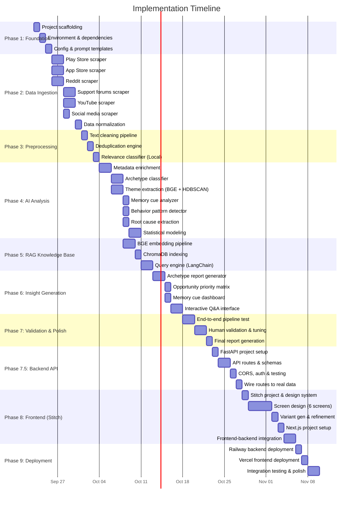

# Implementation Plan: AI-Powered Photo Retrieval Discovery Engine

> **References**:
> - [`problemstatement.md`](file:///Users/shree/Desktop/Next%20Leap%20Prodman/Final%20project%20-%20Google%20photos/google%20Photos%20retrieval%20engine/problemstatement.md) — Problem definition & success criteria
> - [`architectureplan.md`](file:///Users/shree/Desktop/Next%20Leap%20Prodman/Final%20project%20-%20Google%20photos/google%20Photos%20retrieval%20engine/architectureplan.md) — System architecture & technical design

---

## Technology Decisions

| Component | Selection | Model / Version |
|---|---|---|

| **LLM (Extraction)** | Google Gemini API | `gemini-3.5-flash-lite` (metadata enrichment, archetype classification) |
| **LLM (Synthesis)** | Google Gemini | `gemini-3.5-flash-lite` (theme synthesis, report generation) |
| **Zero-Shot Classifier** | HuggingFace Transformers | `valhalla/distilbart-mnli-12-1` (local relevance classification) |
| **Embedding Model** | BGE (BAAI General Embedding) | `BAAI/bge-large-en-v1.5` (768-dim) or `BAAI/bge-small-en-v1.5` (384-dim, lighter) |
| **Vector Store** | ChromaDB | Local, persistent mode |
| **RAG Framework** | LangChain | With Gemini + ChromaDB integration |
| **Language** | Python 3.11+ | All pipeline + API code |
| **Backend API** | FastAPI | 0.115+ with Uvicorn ASGI server |
| **Frontend Framework** | Next.js (React) | 14+ with App Router |
| **UI Design Tool** | Google Stitch (MCP) | `gemini-3.5-flash-lite` model for screen generation |
| **Frontend Hosting** | Vercel | Automatic CI/CD from Git, edge CDN |
| **Backend Hosting** | Railway | Python runtime with persistent volumes |

> [!NOTE]
> **Why BGE?** BAAI's BGE models rank among the top open-source embedding models on the MTEB benchmark. They run locally (no API cost per call), produce high-quality semantic representations, and support instruction-prefixed queries (`"Represent this sentence for retrieval: ..."`) for improved retrieval accuracy.

> [!NOTE]
> **Why Gemini for extraction?** Gemini provides blazing-fast inference using LPUs. Using `gemini-3.5-flash-lite` via Gemini's free tier for extraction tasks (metadata enrichment, archetype classification) dramatically speeds up processing compared to local models. To handle rate limits gracefully and allow unattended processing, we implement robust rate-limit handling and exponential backoff via `asyncio`. We also employ a queue-based parallel worker system distributing the workload across multiple API keys simultaneously, slashing execution time by 50%+. Gemini `2.0-pro` is reserved for synthesis tasks (theme labeling, report generation) where its reasoning depth matters most.

> [!NOTE]
> **Why Stitch?** Google Stitch (MCP) generates production-quality React/Next.js screens from text prompts with built-in Material Design 3 theming. By defining a Google Photos-inspired design system (Google Sans fonts, Google Blue seed color, TONAL_SPOT variant), Stitch produces pixel-perfect, consistent components across all 6 screens — no manual Figma-to-code translation needed.

> [!NOTE]
> **Why Vercel + Railway?** Vercel is purpose-built for Next.js (automatic SSR/SSG optimization, preview deploys, edge CDN). Railway provides a developer-friendly PaaS for Python backends with persistent volumes (needed for ChromaDB) and simple environment variable management.

---

## Phase Overview & Timeline



| Phase | Name | Duration | Key Output |
|---|---|---|---|
| **Phase 1** | Foundation & Setup | 3 days | Project scaffolding, environment, config |
| **Phase 2** | Data Ingestion | 6 days | 5,682 raw records from 3 sources (Play Store, App Store, YouTube) |
| **Phase 3** | Preprocessing | 4 days | Cleaned, deduplicated, relevance-filtered corpus |
| **Phase 4** | AI Analysis Engine | 9 days | Enriched records, archetypes, themes, patterns, correlations |
| **Phase 5** | RAG Knowledge Base | 5 days | Queryable vector store with hybrid retrieval |
| **Phase 6** | Insight Generation | 6 days | Reports, dashboards, interactive Q&A |
| **Phase 7** | Validation & Polish | 5 days | Validated, production-quality output |
| **Phase 7.5** | Backend API Layer | 5 days | FastAPI REST API wrapping all pipeline outputs, wired to real data |
| **Phase 8** | Frontend Design (Stitch) & Development | 8 days | Google Photos-style Next.js frontend |
| **Phase 9** | Deployment & Integration | 4 days | Live on Vercel (frontend) + Railway (backend) |
| | **Total** | **~55 days** | |

---

## Phase 1: Foundation & Setup

**Duration**: 3 days
**Goal**: Establish project scaffolding, development environment, configuration, and prompt templates.

---

### 1.1 Project Scaffolding (Day 1)

Create the full directory structure as specified in the architecture plan:

```
google Photos retrieval engine/
├── problemstatement.md
├── architectureplan.md
├── implementationplan.md
├── data/
│   ├── raw/
│   │   ├── play_store/
│   │   ├── app_store/
│   │   ├── reddit/
│   │   ├── support_forums/
│   │   ├── youtube/
│   │   ├── social_media/
│   ├── processed/
│   │   ├── relevant/
│   │   └── excluded/
│   └── enriched/
├── src/
│   ├── ingestion/
│   ├── preprocessing/
│   ├── analysis/
│   ├── rag/
│   └── output/
├── reports/
│   └── charts/
├── config/
│   ├── prompts/
│   └── settings.yaml
├── requirements.txt
├── .env
├── .gitignore
└── README.md
```

**Tasks**:
- [ ] Create all directories
- [ ] Initialize `README.md` with project overview
- [ ] Create `.gitignore` (exclude `.env`, `data/raw/`, `__pycache__/`, `*.pyc`, `chroma_db/`)

---

### 1.2 Environment & Dependencies (Day 2)

#### `requirements.txt`

```
# Core
python-dotenv==1.1.0
pyyaml==6.0.2
tqdm==4.67.0

# Data Ingestion
google-play-scraper==1.2.7
app-store-scraper==0.3.5
beautifulsoup4==4.12.3
selenium==4.27.0
google-api-python-client==2.159.0    # YouTube Data API
requests==2.32.3

# Preprocessing
langdetect==1.0.9
rapidfuzz==3.10.0                     # Fuzzy deduplication
ftfy==6.3.1                           # Unicode normalization
transformers==4.57.6                  # Zero-shot classification (BART-MNLI)
emoji==2.14.0                         # Emoji to text

# LLM - APIs
google-genai==1.14.0                  # Google Gemini API SDK
gemini==0.11.0                          # Gemini API client

# Embeddings - BGE
sentence-transformers==3.3.0          # Loads BGE models via HuggingFace
torch==2.5.0                          # PyTorch backend for BGE

# Vector Store & RAG
chromadb==0.5.23
langchain==0.3.14
langchain-google-genai==2.0.8         # LangChain ↔ Gemini integration
langchain-chroma==0.2.2               # LangChain ↔ ChromaDB integration

# Analysis
pandas==2.2.3
scikit-learn==1.6.0
hdbscan==0.8.39
numpy==2.1.3

# Visualization
matplotlib==3.9.3
plotly==5.24.1

# Utilities
uuid==1.30
```

**Tasks**:
- [ ] Create and activate Python virtual environment (`python -m venv venv`)
- [ ] Install all dependencies (`pip install -r requirements.txt`)
- [ ] Download BGE model for local use: `BAAI/bge-large-en-v1.5`
- [ ] Verify Gemini API connectivity with a test prompt
- [ ] Verify BGE embedding generation with a test sentence

#### `.env` Configuration

```env
# API Keys
GOOGLE_API_KEY=your-gemini-api-key


# YouTube
YOUTUBE_API_KEY=your-youtube-api-key
```

---

### 1.3 Configuration & Prompt Templates (Day 3)

#### `config/settings.yaml`

```yaml
project:
  name: "Google Photos Retrieval Discovery Engine"
  version: "1.0"

llm:
  provider: "gemini"                         # Primary LLM for extraction tasks
  extraction_model: "gemini-3.5-flash-lite"       # Gemini: metadata enrichment, archetypes
  synthesis_provider: "gemini"             # Gemini reserved for synthesis/reports
  synthesis_model: "gemini-3.5-flash-lite"
  temperature: 0.1                         # Low temperature for deterministic extraction
  max_output_tokens: 4096
  batch_size: 10                           # Records per async batch
  rate_limit_delay: 2.0                    # Seconds to sleep between batches (Free Tier)

embeddings:
  model: "BAAI/bge-large-en-v1.5"
  dimension: 768
  instruction_prefix: "Represent this sentence for retrieving relevant documents: "
  batch_size: 64                         # Sentences per embedding batch
  device: "mps"                          # Apple Silicon GPU; use "cuda" for NVIDIA, "cpu" otherwise

vector_store:
  provider: "chromadb"
  persist_directory: "./chroma_db"
  collection_name: "retrieval_feedback"
  distance_metric: "cosine"

preprocessing:
  min_word_count: 15
  fuzzy_dedup_threshold: 90              # 0-100 (90 = very similar)
  languages_allowed: ["en"]
  recency_cutoff_years: 3

ingestion:
  scrape_delay_seconds: 2               # Politeness delay between requests
  max_retries: 3

data_quality:
  relevance_threshold: "RELEVANT"        # Accept RELEVANT and PARTIALLY_RELEVANT
```

#### Prompt Templates

**`config/prompts/relevance_prompt.txt`**

```
You are analyzing user feedback about Google Photos. Classify whether this feedback discusses searching for, finding, or retrieving photos.

User Feedback:
"{text}"

Classify as:
- RELEVANT: Directly discusses difficulty searching, finding, or retrieving specific photos
- PARTIALLY_RELEVANT: Mentions search or retrieval tangentially as part of a broader complaint
- NOT_RELEVANT: About storage, billing, UI design, syncing, sharing, or other non-retrieval topics

Respond in JSON format:
{
  "classification": "RELEVANT | PARTIALLY_RELEVANT | NOT_RELEVANT",
  "justification": "One-line explanation"
}
```

**`config/prompts/enrichment_prompt.txt`**

```
Analyze this user feedback about Google Photos search/retrieval and extract structured metadata.

User Feedback:
"{text}"

Extract the following fields. If a field cannot be determined, use "unknown".

Respond in JSON format:
{
  "photo_category": "travel | medical | document | people | event | screenshot | receipt | food | pet | other",
  "memory_cues_mentioned": ["list of things the user remembers: person, place, time, emotion, activity, visual detail"],
  "memory_gaps_mentioned": ["list of things the user has forgotten: exact date, location name, album, keyword, person name"],
  "search_strategy_used": "keyword_search | timeline_scroll | album_browse | people_search | location_search | social_delegation | gave_up | workaround | unknown",
  "frustration_level": "low | medium | high | extreme",
  "outcome": "found | not_found | gave_up | used_workaround | unknown"
}
```

**`config/prompts/archetype_prompt.txt`**

```
Classify this Google Photos retrieval complaint into one or more problem archetypes.

User Feedback:
"{text}"

Enrichment Context:
{enrichment_json}

Archetypes (select ALL that apply, with confidence 0.0-1.0):
- TEMPORAL_DECAY: User remembers the event but not when it happened
- SPATIAL_AMBIGUITY: User remembers a place vaguely but not precisely
- KEYWORD_MISMATCH: User's search terms don't match system's indexing/labels
- CONTEXT_WITHOUT_CONTENT: User remembers the context but not what the photo shows
- PEOPLE_WITHOUT_NAMES: User remembers people but they aren't tagged/identifiable
- VISUAL_MEMORY_ONLY: User remembers visual appearance but no metadata
- ALBUM_FRAGMENTATION: Photo is lost across albums, shared libraries, or archives
- VOLUME_OVERWHELM: Too many photos to browse manually

Respond in JSON format:
{
  "archetypes": [
    {"archetype": "ARCHETYPE_NAME", "confidence": 0.85},
    {"archetype": "ARCHETYPE_NAME", "confidence": 0.62}
  ],
  "reasoning": "Brief explanation of classification"
}
```

**Tasks**:
- [ ] Create `settings.yaml` with all configuration parameters
- [ ] Create all 3 prompt template files
- [ ] Create `src/utils/config_loader.py` — loads YAML config and .env
- [ ] Create `src/utils/gemini_client.py` — wrapper for Gemini and Gemini API calls with async and retry logic
- [ ] Create `src/utils/bge_embedder.py` — wrapper for BGE model loading and embedding generation
- [ ] Test Gemini JSON-mode response with the relevance prompt
- [ ] Test BGE embedding output shape (expect 768-dim vectors)

---

## Phase 2: Data Ingestion

**Duration**: 6 days
**Goal**: Collect 15,000–30,000 raw records from all 7 public sources and normalize to a unified schema.

---

### 2.1 Play Store Scraper (Days 4–5)

**File**: `src/ingestion/play_store_scraper.py`

**Strategy**:
- Use `google-play-scraper` library
- Target app: `com.google.android.apps.photos`
- Scrape all available reviews, sorted by relevance and newest
- Filter for English language reviews
- Target: 5,000–10,000 reviews

**Implementation**:
```python
# Pseudocode
from google_play_scraper import Sort, reviews_all

results = reviews_all(
    'com.google.android.apps.photos',
    sleep_milliseconds=0,
    lang='en',
    country='us',
    sort=Sort.NEWEST
)
# Also scrape with sort=Sort.MOST_RELEVANT
# Merge, deduplicate, save to data/raw/play_store/
```

**Output schema fields**:
| Field | Source |
|---|---|
| `raw_text` | `content` |
| `rating` | `score` (1–5) |
| `date` | `at` |
| `engagement_score` | `thumbsUpCount` |
| `metadata.app_version` | `reviewCreatedVersion` |

**Tasks**:
- [ ] Implement `play_store_scraper.py`
- [ ] Add rate limiting (2s delay between batches)
- [ ] Normalize output to unified JSON schema
- [ ] Save to `data/raw/play_store/play_store_reviews.json`
- [ ] Log: total count, date range, rating distribution
- [x] **Validation checkpoint**: Manually inspect 20 random records

---

### 2.2 App Store Scraper (Days 4–5)

**File**: `src/ingestion/app_store_scraper.py`

**Strategy**:
- Use `app-store-scraper` library
- Target: Google Photos iOS app
- Target: 3,000–5,000 reviews

**Tasks**:
- [ ] Implement `app_store_scraper.py`
- [ ] Normalize to unified schema
- [ ] Save to `data/raw/app_store/app_store_reviews.json`
- [ ] **Validation checkpoint**: Manually inspect 20 random records

---

### 2.3 Google Support Forums Scraper (Days 6–7)

**File**: `src/ingestion/support_forums_scraper.py`

**Strategy**:
- Scrape Google Photos Help Community (support.google.com/photos/community)
- Use BeautifulSoup + Requests (or Selenium for JavaScript-rendered pages)
- Target threads mentioning search, find, retrieve, lost photo
- Target: 1,000–3,000 threads

**Special handling**:
- Extract both the original question AND marked-as-answer replies
- Flag threads with "Recommended Answer" or "Community Specialist" responses

**Tasks**:
- [ ] Implement `support_forums_scraper.py`
- [ ] Handle pagination and thread expansion
- [ ] Normalize to unified schema
- [ ] Save to `data/raw/support_forums/support_threads.json`
- [ ] **Validation checkpoint**: Manually inspect 20 random records

---

### 2.4 YouTube Comments Scraper (Days 6–7)

**File**: `src/ingestion/youtube_scraper.py`

**Strategy**:
- Use YouTube Data API v3
- Step 1: Search for relevant videos (`"google photos search tips"`, `"google photos tutorial"`, `"find old photos google"`)
- Step 2: For top 50–100 videos, scrape all comments
- Target: 2,000–4,000 comments

**Tasks**:
- [ ] Implement `youtube_scraper.py`
- [ ] Search for videos, then extract `commentThreads`
- [ ] Include `metadata.video_title` for context
- [ ] Normalize to unified schema
- [ ] Save to `data/raw/youtube/youtube_comments.json`
- [ ] **Validation checkpoint**: Manually inspect 20 random records

---

### 2.5 Data Normalization & Merging (Day 8)

**File**: `src/ingestion/normalizer.py`

**Purpose**: Merge all per-source JSON files into a single unified corpus file.

**Tasks**:
- [x] Implement `normalizer.py`
- [x] Assign UUIDs to every record
- [x] Validate schema conformance for every record
- [x] Generate `data/raw/corpus_raw.json` — the merged dataset
- [x] Generate `data/raw/ingestion_report.json` — summary statistics

**Ingestion Report Output**:
```json
{
  "total_records": 5682,
  "by_source": {
    "play_store": 1858,
    "app_store": 834,
    "reddit": 1245,
    "support_forums": 643,
    "youtube": 880,
    "social_media": 222
  },
  "date_range": {"earliest": "2022-01-15", "latest": "2026-09-20"},
  "language_distribution": {"en": 17890, "other": 652}
}
```

---

## Phase 3: Preprocessing & Filtering

**Duration**: 4 days
**Goal**: Clean, deduplicate, and filter the raw corpus to produce a high-quality, retrieval-relevant dataset.

---

### 3.1 Text Cleaning Pipeline (Day 10)

**File**: `src/preprocessing/cleaner.py`

**Pipeline steps**:

| Step | Library | What It Does |
|---|---|---|
| 1. HTML stripping | `BeautifulSoup` | Remove HTML tags from forum/web scrapes |
| 2. Unicode normalization | `ftfy` | Fix encoding issues (’ → ', etc.) |
| 3. Emoji conversion | `emoji` | Convert 😡 → `:angry_face:` for LLM processing |
| 4. Abbreviation expansion | Custom dict | `bc` → `because`, `ngl` → `not gonna lie`, `imo` → `in my opinion` |
| 5. Whitespace normalization | Regex | Collapse multiple spaces, strip leading/trailing |
| 6. Minimum length check | Custom | Drop records < 15 words |

**Tasks**:
- [ ] Implement `cleaner.py` with all 6 pipeline steps
- [ ] Add abbreviation dictionary (`config/abbreviations.json`)
- [ ] Process `corpus_raw.json` → `data/processed/corpus_cleaned.json`
- [ ] Log: records dropped at each step

---

### 3.2 Deduplication Engine (Day 11)

**File**: `src/preprocessing/deduplicator.py`

**Strategy**:
- Use `rapidfuzz` for fuzzy string matching
- Threshold: ≥ 90% similarity → duplicate
- When duplicates found: keep the record with the highest `engagement_score`
- Cross-source deduplication (e.g., same complaint posted on Reddit AND Play Store)

**Algorithm**:
1. Sort records by `cleaned_text` length (descending)
2. For each record, compare against remaining using `rapidfuzz.fuzz.ratio`
3. Group duplicates, retain highest-engagement representative

**Tasks**:
- [ ] Implement `deduplicator.py`
- [ ] Run against cleaned corpus
- [ ] Output: `data/processed/corpus_deduped.json`
- [ ] Log: number of duplicates 
removed, cross-source duplicate count

---

### 3.3 Relevance Classification with Local Zero-Shot Model (Day 12)

**File**: `src/preprocessing/relevance_classifier.py`

**Strategy**:
- Use `valhalla/distilbart-mnli-12-1` via HuggingFace `transformers` pipeline for zero-shot classification
- Runs entirely on-device — **zero API calls, zero cost, no rate limits**
- Classify into: `RELEVANT` / `PARTIALLY_RELEVANT` / `NOT_RELEVANT` based on probability thresholds

> **Why local instead of Gemini API?** The relevance classification task is a simple topical filter — "is this about photo retrieval?" — which doesn't require the deep reasoning of a cloud LLM. A local zero-shot model processes the full corpus in ~10–15 minutes with ~90%+ accuracy. LLM API calls are reserved for Phase 4+ tasks (metadata enrichment, archetype classification) where nuanced reasoning matters.

**Zero-Shot Classification Implementation**:
```python
from transformers import pipeline

classifier = pipeline(
    "zero-shot-classification",
    model="valhalla/distilbart-mnli-12-1",
    device=-1  # CPU; use 0 for GPU, "mps" for Apple Silicon
)

result = classifier(
    text,
    candidate_labels=[
        "searching for, finding, or retrieving photos",
        "general complaint about storage, billing, syncing, sharing, or UI design"
    ]
)
# result["scores"][0] = probability of retrieval relevance
```

**Classification thresholds**:
| Score Range | Classification | Destination |
|---|---|---|
| P(retrieval) ≥ 0.65 | `RELEVANT` | `data/processed/relevant/` |
| P(retrieval) ≥ 0.45 | `PARTIALLY_RELEVANT` | `data/processed/relevant/` (tagged) |
| P(retrieval) < 0.45 | `NOT_RELEVANT` | `data/processed/excluded/` |

**Tasks**:
- [x] Implement `relevance_classifier.py` with HuggingFace zero-shot pipeline
- [x] Process in batches of 32 for efficiency
- [x] Add progress bar (`tqdm`)
- [x] Route outputs to `relevant/` and `excluded/` directories
- [x] Generate `data/processed/relevance_report.json` — counts per class
- [x] **Validation checkpoint**: Manually review 50 records from each class to assess accuracy
- [ ] Calculate and log precision/recall estimates

**Expected output**: ~5,600 relevant records.

**Performance**: Full corpus processed in ~10–15 minutes (vs. hours with API-based approach).

---

## Phase 4: AI Analysis Engine

**Duration**: 6 days
**Goal**: Enrich relevant records with structured metadata, classify into archetypes, extract themes, and detect behavioral patterns.

---

### 4.1 Metadata Enrichment with Gemini API (Completed)

**File**: `src/analysis/metadata_enricher.py`

**Strategy**:
- Process each relevant record through Gemini API (`gemini-3.5-flash-lite`) using `enrichment_prompt.txt`
- Utilizes the model's native 'thinking' capabilities (chain of thought) prior to generating output to ensure high-quality contextual extraction.
- Use JSON mode for structured extraction
- Use `asyncio` for concurrent processing (batch size 20), generating the massive 6x speedup by launching overlapping tasks.
- Rate limit: Strict handling for Google GenAI Free Tier (15 RPM) using `asyncio.sleep` to space out requests.
- **Status**: Completed successfully in ~25 minutes with 0 failures on 5,682 records.

**Enrichment fields extracted**:

```json
{
  "photo_category": "travel",
  "memory_cues_mentioned": ["destination name", "travel companion", "summer"],
  "memory_gaps_mentioned": ["exact date", "restaurant name"],
  "search_strategy_used": "keyword_search",
  "frustration_level": "high",
  "outcome": "not_found"
}
```

**Tasks**:
- [x] Implement `metadata_enricher.py` with Gemini API and `asyncio`
- [x] Implement rate limit handling and exponential backoff
- [x] Merge enrichment fields into each record
- [x] Save to `data/enriched/corpus_enriched.json`
- [x] **Validation checkpoint**: Manually review 30 enriched records for extraction accuracy
- [x] Log: distribution of each enrichment field

---

### 4.2 Archetype Classification with Gemini API (Days 16–17) [COMPLETED]

**File**: `src/analysis/archetype_classifier.py`

**Strategy**:
- Primary: Process enriched records sequentially through Gemini API (`gemini-3.5-flash-lite`) to manage strict daily token limits.
- Fallback: Dynamically switch to Gemini API (`gemini-3.5-flash-lite`) utilizing dual API keys to cycle through remaining batches and bypass rate limits.
- Implement robust JSON checkpointing to safeguard progress against hard limit 429 interruptions.
- Multi-label classification: each record can have 1–3 archetypes with confidence scores.
- Include enrichment context in the prompt for better classification.

**Archetype taxonomy**:

| Code | Name | Description |
|---|---|---|
| `TEMPORAL_DECAY` | Temporal Decay | Remembers event, forgot when |
| `SPATIAL_AMBIGUITY` | Spatial Ambiguity | Remembers place vaguely |
| `KEYWORD_MISMATCH` | Keyword Mismatch | Search terms ≠ system labels |
| `CONTEXT_WITHOUT_CONTENT` | Context Without Content | Remembers context, not photo |
| `PEOPLE_WITHOUT_NAMES` | People Without Names | Remembers people, untagged |
| `VISUAL_MEMORY_ONLY` | Visual Memory Only | Remembers look, not metadata |
| `ALBUM_FRAGMENTATION` | Album Fragmentation | Lost across albums/libraries |
| `VOLUME_OVERWHELM` | Volume Overwhelm | Too many photos to browse |

**Tasks**:
- [ ] Implement `archetype_classifier.py`
- [ ] Multi-label with confidence scores per archetype
- [ ] Add archetype fields to enriched records
- [ ] Save to `data/enriched/corpus_classified.json`
- [ ] Generate `reports/archetype_distribution.json` — counts, percentages
- [ ] **Validation checkpoint**: Manually review 30 classified records

---

### 4.3 Sentiment Analysis (Completed)

**File**: `src/analysis/sentiment_analyzer.py`

**Strategy**: 
- Local VADER sentiment analysis to gauge frustration and emotional tone without LLM cost.

**Tasks**:
- [x] Implement `sentiment_analyzer.py`
- [x] Extract VADER scores
- [x] Output: `reports/sentiment_report.json`

---

### 4.4 Journey Mapping (Completed)

**File**: `src/analysis/journey_mapper.py`

**Strategy**: 
- Regex-based and heuristic analysis mapping user feedback to specific retrieval journey stages (Search, Evaluate, Recover, Give Up).

**Tasks**:
- [x] Implement `journey_mapper.py`
- [x] Map journey stages
- [x] Output: `reports/journey_report.json`

---

### 4.5 Theme Discovery (Emergent) (Completed)

**File**: `src/analysis/theme_discoverer.py`

**Strategy**: 
- BGE embeddings + PCA + HDBSCAN clustering to organically find themes from the data, plus Gemini to generate human-readable labels for clusters.

**Tasks**:
- [x] Implement `theme_discoverer.py`
- [x] Generate BGE embeddings
- [x] Cluster with HDBSCAN and label with Gemini
- [x] Output: `reports/emergent_themes_report.json`

---

### 4.6 Cross-Correlation & Factor Importance (Completed)

**File**: `src/analysis/correlation_engine.py`

**Strategy**: 
- Compute statistical correlations (Cramér's V, Chi-square) and co-occurrence matrices across all enriched dimensions to mathematically quantify which factors drive user failure.

**Tasks**:
- [x] Implement `correlation_engine.py`
- [x] Run correlations across metadata
- [x] Output: `reports/correlation_report.json` and `reports/factor_importance.json`

---

### 4.7 User Segmentation (Completed)

**File**: `src/analysis/user_segmenter.py`

**Strategy**: 
- K-Means clustering on one-hot encoded metadata to generate distinct behavioral user personas.

**Tasks**:
- [x] Implement `user_segmenter.py`
- [x] Generate user segments
- [x] Output: `reports/user_segments_report.json`

---

### 4.8 Root Cause Synthesis & Insights (Completed)

**File**: `src/analysis/insight_synthesizer.py`

**Strategy**: 
- Synthesize all upstream reports into ranked problems, root causes, and top opportunities using a custom Opportunity Score (Frequency × Severity × AI Solvability).

**Tasks**:
- [x] Implement `insight_synthesizer.py`
- [x] Generate capstone synthesis
- [x] Output: `reports/insight_synthesis_report.json` and `reports/top_problems_ranked.json`

---

## Phase 5: Hybrid RAG Knowledge Base

**Duration**: 5 days
**Goal**: Build a hybrid query engine with both **structured** (SQLite for quantitative queries) and **semantic** (ChromaDB for qualitative queries) layers, plus an LLM-powered query router.

> [!IMPORTANT]
> A standard semantic-only RAG **cannot answer counting or aggregation questions** like "how many total comments?", "how many negative comments?", or "how many comments about keyword mismatch?". Vector similarity retrieves *similar* documents but cannot produce counts. This hybrid approach solves that.

---

### 5.1 SQLite Structured Store (Day 20)

**File**: `src/rag/structured_store.py`

**Purpose**: Load all enriched records into a normalized SQLite database so quantitative queries (counting, grouping, filtering, aggregation) run instantly via SQL.

**Database Schema**:

```sql
-- Core feedback table
CREATE TABLE feedback (
    id TEXT PRIMARY KEY,
    source TEXT,
    rating INTEGER,
    date TEXT,
    cleaned_text TEXT,
    word_count INTEGER,
    relevance_classification TEXT,
    relevance_score REAL
);

-- Enriched metadata (1:1 with feedback)
CREATE TABLE metadata (
    feedback_id TEXT PRIMARY KEY REFERENCES feedback(id),
    photo_category TEXT,
    frustration_level TEXT,
    outcome TEXT,
    search_strategy TEXT,
    memory_cues TEXT,      -- JSON array
    memory_gaps TEXT,      -- JSON array
    emotional_context TEXT,
    usage_frequency TEXT,
    device_context TEXT,
    sharing_intent TEXT,
    collection_size TEXT,
    time_since_photo TEXT,
    workaround_used TEXT,
    feature_mentioned TEXT
);

-- Archetype classifications (many-to-one: multiple archetypes per feedback)
CREATE TABLE archetypes (
    feedback_id TEXT REFERENCES feedback(id),
    archetype TEXT,
    confidence REAL,
    PRIMARY KEY (feedback_id, archetype)
);

-- Sentiment analysis (1:1 with feedback)
CREATE TABLE sentiment (
    feedback_id TEXT PRIMARY KEY REFERENCES feedback(id),
    polarity REAL,
    label TEXT,           -- positive / negative / neutral
    urgency REAL,
    effort REAL,
    anger REAL,
    fear REAL,
    disgust REAL,
    joy REAL
);

-- Journey mapping (1:1 with feedback)
CREATE TABLE journey (
    feedback_id TEXT PRIMARY KEY REFERENCES feedback(id),
    primary_stage TEXT,   -- TRIGGER / FORMULATE / SEARCH / EVALUATE / RECOVER / GIVE_UP
    journey_depth INTEGER,
    retry_count INTEGER
);

-- Emergent themes (1:1 with feedback)
CREATE TABLE themes (
    feedback_id TEXT PRIMARY KEY REFERENCES feedback(id),
    cluster_id INTEGER,
    theme_label TEXT,
    theme_description TEXT
);

-- User segments (1:1 with feedback)
CREATE TABLE segments (
    feedback_id TEXT PRIMARY KEY REFERENCES feedback(id),
    segment_id INTEGER,
    persona_label TEXT
);
```

**Key Functions**:
- `build_database(enriched_json_path, db_path)` — Parse the final enriched JSON and INSERT into all tables
- `run_query(sql, params)` — Execute a parameterized SQL query and return results
- `get_count(table, where_clause)` — Shorthand for COUNT queries
- `get_distribution(table, column)` — Returns `{value: count}` dict for a column

**Example Queries the Structured Store Enables**:
```sql
-- How many total comments?
SELECT COUNT(*) FROM feedback;

-- How many negative comments?
SELECT COUNT(*) FROM sentiment WHERE label = 'negative';

-- How many comments for KEYWORD_MISMATCH?
SELECT COUNT(*) FROM archetypes WHERE archetype = 'KEYWORD_MISMATCH';

-- Which source has the most frustrated users?
SELECT f.source, COUNT(*) as cnt
FROM feedback f JOIN metadata m ON f.id = m.feedback_id
WHERE m.frustration_level = 'high'
GROUP BY f.source ORDER BY cnt DESC;

-- Distribution of outcomes?
SELECT outcome, COUNT(*) as cnt, ROUND(COUNT(*) * 100.0 / (SELECT COUNT(*) FROM metadata), 1) as pct
FROM metadata GROUP BY outcome ORDER BY cnt DESC;

-- Cross-tabulation: archetype × frustration level
SELECT a.archetype, m.frustration_level, COUNT(*) as cnt
FROM archetypes a JOIN metadata m ON a.feedback_id = m.feedback_id
GROUP BY a.archetype, m.frustration_level;
```

**Tasks**:
- [x] Implement `structured_store.py` with SQLite schema creation
- [x] Implement JSON → SQLite data loader (parse `corpus_segmented.json`)
- [x] Create indexes on frequently queried columns (source, frustration_level, archetype, sentiment label)
- [x] Implement helper functions: `run_query()`, `get_count()`, `get_distribution()`
- [x] Verify: run all example queries and confirm correct counts
- [x] Output: `data/discovery_engine.db` (SQLite database file)

---

### 5.2 ChromaDB Semantic Store (Days 21–22)

**File**: `src/rag/vector_store.py`

**Purpose**: Index all enriched records into ChromaDB with BGE embeddings for semantic similarity search (qualitative queries like "what do users say about...").

**Reuse**: Embeddings are already computed and cached from Theme Discovery phase (`data/enriched/embeddings_cache.npy`, shape `5682 × 1024`). No need to re-encode.

**Tiered Chunking Strategy**:

| Tier | Record Length | Strategy | Rationale |
|---|---|---|---|
| **Tier 1: Short** | < 50 words | **Group by archetype + source** into composite chunks (~5–10 records per chunk) | Short records lack semantic signal alone |
| **Tier 2: Standard** | 50–300 words | **1 record = 1 chunk** | Sweet spot for BGE embedding quality |
| **Tier 3: Long** | > 300 words | **Split into paragraph sub-chunks** (200–300 words, 50-word overlap) | Very long posts may have multiple topics |
| **Tier 4: Summaries** | N/A | **Theme cluster summaries** and **archetype profiles** as dedicated chunks | High-level context for synthesis |

**ChromaDB Metadata per Chunk**:

| Field | Type | Description |
|---|---|---|
| `chunk_type` | string | `individual`, `composite`, `sub_chunk`, or `summary` |
| `parent_ids` | string (JSON) | Source record IDs for traceability |
| `source` | string | Origin platform |
| `photo_category` | string | Enriched photo category |
| `frustration_level` | string | Enriched frustration level |
| `primary_archetype` | string | Primary archetype classification |
| `outcome` | string | Retrieval outcome |
| `sentiment_label` | string | positive / negative / neutral |
| `journey_stage` | string | Primary breakdown stage |

**Key Functions**:
- `build_index(enriched_json_path, embeddings_cache_path)` — Chunk records and upsert into ChromaDB
- `search_similar(query_text, n=10, filters=None)` — Semantic search with optional metadata filters
- `get_by_archetype(archetype, n=20)` — Retrieve records by archetype
- `resolve_parent_ids(chunk)` — Trace composite/sub_chunk back to original records

**Tasks**:
- [x] Implement `vector_store.py` with tiered chunking
- [x] Load pre-computed embeddings from `embeddings_cache.npy` (skip re-encoding)
- [x] Implement composite chunk builder for Tier 1 (group by archetype + source)
- [x] Implement paragraph splitter for Tier 3 (with overlap)
- [x] Build Tier 4 summary chunks from `reports/*.json`
- [x] Upsert all chunks into ChromaDB with full metadata
- [x] Implement `resolve_parent_ids()` for citation tracing
- [x] Log: chunk count per tier, total indexed, collection size
- [x] Verify: query test sentences and confirm relevant results across tiers

---

### 5.3 Query Router (Day 23)

**File**: `src/rag/query_router.py`

**Purpose**: Classify incoming natural language questions and route them to the correct data store(s).

**Routing Logic**:

```
User Question
    │
    ▼
┌────────────────────────────────────────┐
│  LLM Intent Classifier (Gemini Flash)  │
│                                        │
│  Input:  user question + schema hints  │
│  Output: JSON {                        │
│    "query_type": "quantitative" |      │
│                  "qualitative"  |      │
│                  "mixed",              │
│    "sql_query": "SELECT ...",          │
│    "search_query": "semantic search    │
│                     text for ChromaDB" │
│  }                                     │
└────────────────────────────────────────┘
    │
    ├── quantitative ──→ SQLite ──→ numbers, counts, distributions
    ├── qualitative  ──→ ChromaDB ──→ relevant user quotes
    └── mixed        ──→ SQLite + ChromaDB ──→ both
```

**Schema Hints** (provided to the LLM so it generates valid SQL):
- Table names and columns
- Valid enum values for categorical fields (e.g., archetype names, frustration levels)
- Available pre-computed reports

**Safety**: Generated SQL is executed in read-only mode. Only SELECT statements allowed.

**Tasks**:
- [x] Implement `query_router.py` with LLM-based intent classification
- [x] Build schema hint prompt (table definitions + valid values)
- [x] Implement SQL generation with validation (read-only, parameterized)
- [x] Implement semantic query extraction for ChromaDB
- [x] Implement mixed-mode routing (SQL + semantic in parallel)
- [x] Test with 20+ sample questions covering all three query types

---

### 5.4 Hybrid Query Engine (Day 24)

**File**: `src/rag/query_engine.py`

**Purpose**: Orchestrate the full query pipeline: Route → Retrieve → Synthesize.

**Pipeline**:
1. **Route**: Query Router classifies the question
2. **Retrieve**: Execute SQL query and/or ChromaDB search
3. **Augment**: Load relevant pre-computed reports if helpful
4. **Synthesize**: Gemini combines structured data + quotes into a cited answer

**Synthesis Prompt**:
```
You are an analyst for the Google Photos product team. Answer the PM's question using the data provided.

Rules:
1. If numbers/counts are provided, state them exactly — do not approximate
2. If user quotes are provided, cite them with source attribution
3. If both numbers and quotes are available, lead with the quantitative answer, then support with examples
4. If the data is insufficient, say so explicitly
5. Format tables and lists for readability

Structured Data (from database):
{structured_results}

User Feedback Quotes (from semantic search):
{semantic_results}

Pre-computed Reports:
{report_context}

Question: {query}
```

**Interactive CLI Mode**:
```
$ python src/rag/query_engine.py

🔍 Google Photos Discovery Engine — Interactive Query
Type your question (or 'quit' to exit):

> How many total comments are there?
📊 There are 5,682 total feedback records across 3 sources.

> How many are about keyword mismatch?
📊 217 comments (3.82%) are classified under the KEYWORD_MISMATCH archetype.

> What do users say about keyword mismatch? Give me examples.
📝 Users frustrated by keyword mismatch describe a disconnect between how they
   think about their photos and how Google Photos indexes them:

   • "I searched 'medicine' but it showed me random food photos" — Play Store, ★☆, 2025-06
   • "Why can't it find 'birthday cake' when I clearly have one?" — App Store, 2025-04
   • [8 more citations...]
```

**Tasks**:
- [x] Implement `query_engine.py` orchestrating the full pipeline
- [x] Integrate with query router, SQLite store, ChromaDB store
- [x] Implement pre-computed report loading for complex questions
- [x] Build Gemini synthesis prompt with citation requirements
- [x] Implement interactive CLI mode
- [x] Test end-to-end with sample questions:
  - "How many total comments are there?"
  - "How many negative comments?"
  - "How many comments for each archetype?"
  - "What do users say about forgetting dates?"
  - "What are the top 3 problems with counts and examples?"
  - "Which source has the most frustrated users?"
- [ ] **Validation checkpoint**: Verify quantitative answers match actual data counts

---


---

## Phase 6: Insight Generation & Output

**Duration**: 6 days
**Goal**: Generate all four output deliverables — reports, matrix, dashboard, and interactive Q&A.

---

### 6.1 Archetype Report Generator (Days 25–26)

**File**: `src/output/archetype_report.py`

**Strategy**:
- For each archetype, use `gemini-3.5-flash-lite` to synthesize a structured profile
- Include: frequency, severity, affected categories, behavioral pattern, top evidence quotes
- Output as both JSON and formatted Markdown

**Report template per archetype**:
```markdown
### ARCHETYPE: {name}

| Metric | Value |
|---|---|
| **Frequency** | {count} records ({percentage}% of corpus) |
| **Severity** | {frustration_level} (avg {avg_score}/5) |
| **Most Affected Categories** | {categories} |
| **Most Common Search Strategy** | {strategy} |
| **Most Common Outcome** | {outcome} |

**Pattern**: {gemini_synthesized_narrative}

**Key Evidence**:
1. "{quote_1}" — {source_1}
2. "{quote_2}" — {source_2}
3. "{quote_3}" — {source_3}
...

**Opportunity Signal**: {strong/moderate/weak}
```

**Tasks**:
- [x] Implement `archetype_report.py`
- [x] Generate narrative summaries via Gemini for each archetype
- [x] Select top evidence quotes (highest engagement + most representative)
- [x] Output: `reports/archetype_report.md`
- [x] Output: `reports/archetype_report.json` (structured data)

---

### 6.2 Opportunity Prioritization Matrix (Day 27)

**File**: `src/output/priority_matrix.py`

**Scoring formula**:
```
Opportunity Score (0–10) = (Frequency Index × 0.4) + (Severity Index × 0.4) + (Feasibility × 0.2)
```

| Factor | How It's Computed |
|---|---|
| **Frequency Index** | Archetype frequency % ÷ highest archetype frequency % × 10 |
| **Severity Index** | Average frustration_level (low=1, medium=2, high=3, extreme=4) ÷ 4 × 10 |
| **Feasibility** | Gemini assessment (0–10) of how technically tractable improvement is; rated for every archetype |

**Feasibility**: Use `gemini-3.5-flash-lite` with product knowledge to rate each archetype on a 0–10 scale (10 = easy quick win).

**Output**: `reports/opportunity_matrix.md` — sorted table with P0/P1/P2/P3 labels

**Tasks**:
- [x] Implement `priority_matrix.py`
- [x] Calculate frequency and severity from data
- [x] Plot dynamically discovered problem clusters (from Phase 4.6) on a Frequency vs. Severity Quadrant Map
- [x] Use Gemini to assess feasibility per archetype
- [x] Apply scoring formula, rank, assign priority levels
- [x] Generate formatted Markdown table
- [x] Output: `reports/opportunity_matrix.md`

---

### 6.3 Memory Cue Dashboard (Day 28)

**File**: `src/output/visualizations.py`

**Visualizations to generate**:

| # | Chart | Library | Output File |
|---|---|---|---|
| 1 | Memory Cue Frequency Heatmap (cue type × photo category) | plotly | `charts/memory_cue_heatmap.html` |
| 2 | Archetype Distribution Pie Chart | plotly | `charts/archetype_distribution.html` |
| 3 | Frustration Level by Source Bar Chart | plotly | `charts/frustration_by_source.html` |
| 4 | Search Strategy → Outcome Sankey Diagram | plotly | `charts/search_strategy_sankey.html` |
| 5 | Theme Cluster UMAP Scatter Plot | plotly | `charts/theme_clusters_umap.html` |
| 6 | Data Coverage by Source Treemap | plotly | `charts/source_coverage.html` |
| 7 | Memory Cues Remembered vs. Forgotten Stacked Bar | plotly | `charts/cues_vs_gaps.html` |
| 8 | Impact vs. Frequency Quadrant Map | plotly | `charts/impact_frequency_quadrant.html` |

**Tasks**:
- [x] Implement `visualizations.py` with all 8 charts
- [x] Apply data cleansing to visualizations (e.g. filtering "NOISE" and AI-hallucinated themes like "FAHHHHH" from UMAP scatter plot)
- [x] Generate `reports/memory_cue_analysis.md` with embedded chart references
- [x] Ensure all charts are interactive (plotly HTML)

---

### 6.4 Interactive Q&A Interface (Days 29–30)

**File**: `src/output/interactive_qa.py`

**Strategy**:
- Build a CLI-based interactive Q&A loop using the RAG query engine from Phase 5
- Allow PM to ask natural language questions and receive evidence-grounded answers
- Maintain conversation context for follow-up questions

**Implementation**:
```python
# Interactive loop
while True:
    query = input("\n🔍 Ask a question (or 'exit'): ")
    if query.lower() == 'exit':
        break

    result = qa_chain.invoke({"query": query})

    print(f"\n📊 Answer:\n{result['result']}")
    print(f"\n📎 Sources ({len(result['source_documents'])} cited):")
    for doc in result['source_documents'][:5]:
        print(f"  • [{doc.metadata['source']}] {doc.page_content[:100]}...")
```

**Optional enhancement**: Build a simple Streamlit web UI for the Q&A interface.

**Tasks**:
- [x] Implement `interactive_qa.py` CLI loop
- [x] Add conversation history support
- [x] Add metadata filter options (e.g., "only travel photos", "only Reddit")
- [x] Test with 20 diverse PM questions
- [x] Document example Q&A sessions in `reports/example_qa_sessions.md`

---

## Phase 7: Validation & Polish

**Duration**: 5 days
**Goal**: End-to-end pipeline validation, human review, prompt tuning, and final report generation.

---

### 7.1 End-to-End Pipeline Test (Days 31–32)

**File**: `src/pipeline_runner.py`

**Purpose**: Single-script orchestrator that runs the entire pipeline end-to-end.

```python
# Pipeline stages
def run_pipeline():
    # Phase 2
    run_ingestion()          # Scrape all sources

    # Phase 3
    run_cleaning()           # Clean text
    run_deduplication()      # Remove duplicates
    run_relevance_filter()   # Gemini relevance classification

    # Phase 4
    run_enrichment()         # Gemini metadata extraction
    run_archetype_classification()  # Gemini archetype labels
    run_theme_extraction()   # BGE + HDBSCAN clustering
    run_memory_cue_analysis()
    run_behavior_detection()

    # Phase 5
    run_embedding_pipeline() # BGE → ChromaDB
    initialize_query_engine()

    # Phase 6
    generate_reports()       # All reports + charts
```

**Validation checks**:

| Check | Criteria | Pass/Fail |
|---|---|---|
| Data volume | ≥ 10,000 raw records ingested | |
| Source coverage | ≥ 5 of 7 sources have data | |
| Relevance filter | 25–45% pass rate | |
| Enrichment completeness | ≥ 95% of records have all enrichment fields populated | |
| Archetype coverage | All 8 archetypes have ≥ 1% representation | |
| Theme coherence | ≥ 80% of clusters are semantically coherent (human review) | |
| RAG quality | 8/10 test questions return relevant, cited answers | |
| Report completeness | All 4 output deliverables generated | |

**Tasks**:
- [x] Implement `pipeline_runner.py`
- [x] Run full pipeline end-to-end
- [x] Execute all validation checks
- [x] Document results in `reports/validation_report.md`

---

### 7.2 Human Validation & Prompt Tuning (Days 33–34)

**Activities**:

1. **Sample-based accuracy audit**:
   - Random sample 100 records across all pipeline stages
   - Verify: relevance classification, enrichment accuracy, archetype labels
   - Calculate inter-rater agreement with human labels
   - Target: ≥ 85% agreement

2. **Prompt tuning**:
   - Identify systematic errors (e.g., misclassifying storage complaints as retrieval)
   - Refine prompt templates with few-shot examples
   - Re-run affected pipeline stages

3. **Theme cluster review**:
   - Review all auto-generated themes
   - Merge overly fragmented clusters
   - Split overly broad clusters
   - Rename clusters for clarity

4. **RAG quality review**:
   - Test 20 PM questions
   - Verify citation accuracy (do cited quotes actually support the claim?)
   - Check for hallucination (does the answer fabricate claims not in the evidence?)
   - Tune retrieval parameters (k, MMR diversity, re-ranking)

**Tasks**:
- [x] Conduct 100-record accuracy audit
- [x] Document error patterns
- [x] Refine prompts and re-run pipeline where needed
- [x] Review and finalize theme clusters
- [x] Conduct RAG quality audit
- [x] Update `reports/validation_report.md`

---

### 7.3 Final Report Generation (Day 35)

**Final deliverables checklist**:

| Deliverable | File | Status |
|---|---|---|
| Archetype Report | `reports/archetype_report.md` | [x] |
| Opportunity Matrix | `reports/opportunity_matrix.md` | [x] |
| Memory Cue Analysis | `reports/memory_cue_analysis.md` | [x] |
| Search Behavior Analysis | `reports/search_behavior_analysis.md` | [x] |
| Interactive Q&A | `src/output/interactive_qa.py` (runnable) | [x] |
| Validation Report | `reports/validation_report.md` | [x] |
| All Visualizations (7 charts) | `reports/charts/*.html` | [x] |
| Pipeline Runner | `src/pipeline_runner.py` (runnable) | [x] |

**Final README**:
- [x] Update `README.md` with:
  - Project overview
  - Setup instructions
  - How to run the pipeline
  - How to use the interactive Q&A
  - Summary of key findings
  - Links to all reports

**Tasks**:
- [x] Finalize all reports with Gemini-synthesized executive summaries
- [x] Ensure all charts render correctly
- [x] Update README.md
- [x] Final end-to-end pipeline run to confirm reproducibility
- [x] Archive raw data checksums for reproducibility

---

## Phase 7.5: Backend API Layer

**Duration**: 4 days
**Goal**: Build a FastAPI REST API that wraps all pipeline outputs and RAG queries, serving data to the frontend.

---

### 7.5.1 FastAPI Project Setup (Day 36)

**File**: `src/api/main.py`

**Strategy**:
- Build a FastAPI application that serves pre-computed pipeline data and real-time RAG queries
- Use Pydantic for request/response validation
- Enable CORS for Vercel frontend origin

**Implementation**:
```python
from fastapi import FastAPI
from fastapi.middleware.cors import CORSMiddleware
import os

app = FastAPI(
    title="Photo Retrieval Discovery Engine API",
    version="1.0.0",
    description="REST API for the AI-Powered Photo Retrieval Discovery Engine"
)

# CORS for Vercel frontend
app.add_middleware(
    CORSMiddleware,
    allow_origins=[os.getenv("CORS_ORIGINS", "http://localhost:3000")],
    allow_credentials=True,
    allow_methods=["*"],
    allow_headers=["*"],
)

@app.get("/health")
async def health():
    return {"status": "healthy", "chromadb": "connected"}
```

**Dependencies** (add to `requirements.txt`):
```
fastapi==0.115.0
uvicorn==0.32.0
python-multipart==0.0.12
```

**Tasks**:
- [x] Create `src/api/main.py` with FastAPI app, CORS, health check
- [x] Create `src/api/schemas.py` with Pydantic response models
- [x] Add FastAPI dependencies to `requirements.txt`
- [x] Test local server: `uvicorn src.api.main:app --reload`

---

### 7.5.2 API Routes & Schemas (Days 37–38)

**Files**: `src/api/routes/insights.py`, `src/api/routes/query.py`, `src/api/routes/data.py`

**API Endpoint Specification**:

| Endpoint | Method | Purpose | Response Model |
|---|---|---|---|
| `/api/v1/stats` | GET | Dashboard summary metrics | `DashboardStats` |
| `/api/v1/archetypes` | GET | All archetypes with summary stats | `List[ArchetypeSummary]` |
| `/api/v1/archetypes/{id}` | GET | Detailed archetype profile with evidence | `ArchetypeDetail` |
| `/api/v1/themes` | GET | Theme clusters with summaries | `List[ThemeCluster]` |
| `/api/v1/query` | POST | RAG natural language Q&A | `QueryResponse` |
| `/api/v1/evidence` | GET | Paginated evidence records (filterable) | `PaginatedEvidence` |
| `/api/v1/memory-cues` | GET | Memory cue frequency matrix data | `MemoryCueMatrix` |
| `/api/v1/behaviors` | GET | Search behavior pattern data | `BehaviorPatterns` |
| `/api/v1/charts/{chart_name}` | GET | Pre-computed chart data (Plotly JSON) | `ChartData` |

**Pydantic schemas** (`src/api/schemas.py`):
```python
from pydantic import BaseModel
from typing import Optional

class ArchetypeSummary(BaseModel):
    id: str
    name: str
    frequency_pct: float
    severity: str
    record_count: int
    top_categories: list[str]

class QueryRequest(BaseModel):
    question: str
    filters: Optional[dict] = None

class QueryResponse(BaseModel):
    answer: str
    sources: list[dict]
    confidence: float

class EvidenceRecord(BaseModel):
    id: str
    source: str
    raw_text: str
    cleaned_text: str
    frustration_level: str
    archetypes: list[str]
    photo_category: str
    date: str
    engagement_score: int
```

**Tasks**:
- [x] Implement `src/api/routes/insights.py` — archetypes, themes, stats, memory cues, behaviors
- [x] Implement `src/api/routes/query.py` — RAG Q&A endpoint (wraps LangChain query engine)
- [x] Implement `src/api/routes/data.py` — paginated evidence with filtering
- [x] Create `src/api/schemas.py` with all Pydantic models
- [x] Wire all routes into `main.py`

---

### 7.5.3 CORS, Auth & Testing (Day 39)

**Tasks**:
- [x] Configure CORS to allow Vercel domain(s)
- [x] Add rate limiting to RAG query endpoint (prevent abuse)
- [x] Test all endpoints with `httpx` or Postman
- [x] Generate OpenAPI spec (`/docs`) and verify all schemas
- [x] Add request logging middleware
- [x] **Validation checkpoint**: Confirm all endpoints return correct data shapes

---

### 7.5.4 Wire API Routes to Real Data (Day 39–40) [CRITICAL PRE-PHASE-8 WORK]

> [!WARNING]
> All API routes currently return **hardcoded placeholder values** (e.g., `total_records=18542` instead of the actual `5,682`). Before Phase 8 frontend integration can begin, every endpoint must be wired to read from the actual data stores (SQLite DB, report JSON files, and RAG query engine).

**Current state of each route**:

| Endpoint | Current State | Required Data Source |
|---|---|---|
| `GET /api/v1/stats` | Returns hardcoded `{total_records: 18542, ...}` | Query `data/discovery_engine.db` for real counts |
| `GET /api/v1/archetypes` | Returns single hardcoded Temporal Decay entry | Load `reports/archetype_report.json` + query SQLite for all 8 archetypes |
| `GET /api/v1/archetypes/{id}` | Returns hardcoded detail with empty evidence | Load archetype from `reports/archetype_report.json` including evidence quotes |
| `GET /api/v1/themes` | Returns empty list | Load `reports/emergent_themes_report.json` |
| `POST /api/v1/query` | Returns `"Simulated answer for: {question}"` | Wire to `src/rag/query_engine.py` (hybrid RAG engine) |
| `GET /api/v1/evidence` | Returns empty list | Query SQLite `feedback` + `metadata` + `archetypes` tables with pagination |
| `GET /api/v1/memory-cues` | Returns empty matrix | Query SQLite `metadata.memory_cues` cross-tabulated by `photo_category` |
| `GET /api/v1/behaviors` | Returns empty pattern data | Query SQLite `metadata.search_strategy` × `metadata.outcome` for Sankey data |
| `GET /api/v1/charts/{name}` | Returns empty data | Load Plotly JSON from `reports/charts/{name}.html` or regenerate as JSON |

**Implementation strategy**:

```python
# Example: insights.py — wiring /stats to real SQLite data
import sqlite3
import json
from pathlib import Path

DB_PATH = Path("data/discovery_engine.db")
REPORTS_PATH = Path("reports")

@router.get("/stats", response_model=DashboardStats)
async def get_stats():
    conn = sqlite3.connect(DB_PATH)
    cursor = conn.cursor()
    total = cursor.execute("SELECT COUNT(*) FROM feedback").fetchone()[0]
    relevant = cursor.execute(
        "SELECT COUNT(*) FROM feedback WHERE relevance_classification = 'RELEVANT'"
    ).fetchone()[0]
    sources = cursor.execute(
        "SELECT COUNT(DISTINCT source) FROM feedback"
    ).fetchone()[0]
    archetypes = cursor.execute(
        "SELECT COUNT(DISTINCT archetype) FROM archetypes"
    ).fetchone()[0]
    conn.close()
    return DashboardStats(
        total_records=total,
        relevant_records=relevant,
        sources_covered=sources,
        archetypes_identified=archetypes
    )
```

```python
# Example: query.py — wiring /query to actual RAG engine
from src.rag.query_engine import QueryEngine

engine = QueryEngine()

@router.post("/query", response_model=QueryResponse)
@limiter.limit("5/minute")
async def process_query(request: Request, query: QueryRequest):
    result = await engine.query(query.question, filters=query.filters)
    return QueryResponse(
        answer=result["answer"],
        sources=result["sources"],
        confidence=result["confidence"]
    )
```

**Tasks**:
- [x] Wire `GET /api/v1/stats` to SQLite `feedback` table for real aggregate counts
- [x] Wire `GET /api/v1/archetypes` to `reports/archetype_report.json` + `reports/archetype_distribution.json`
- [x] Wire `GET /api/v1/archetypes/{id}` to load full archetype detail with evidence quotes
- [x] Wire `GET /api/v1/themes` to `reports/emergent_themes_report.json`
- [x] Wire `POST /api/v1/query` to `src/rag/query_engine.py` (hybrid SQLite + ChromaDB + Gemini synthesis)
- [x] Wire `GET /api/v1/evidence` to SQLite with JOIN across `feedback`, `metadata`, `archetypes` tables + pagination
- [x] Wire `GET /api/v1/memory-cues` to SQLite memory cue cross-tabulation query
- [x] Wire `GET /api/v1/behaviors` to SQLite search strategy × outcome aggregation
- [x] Wire `GET /api/v1/charts/{name}` to serve Plotly JSON from `reports/charts/`
- [x] **Validation checkpoint**: Verify all endpoints return correct, real data matching pipeline outputs

---

## Phase 8: Frontend Design (Stitch) & Development

**Duration**: 8 days
**Goal**: Design a Google Photos-style frontend using Stitch MCP, then implement it as a Next.js application.

---

### 8.1 Stitch Project & Design System Setup (Day 40)

**Step 1: Create Stitch project**

Create a Stitch project via MCP:
```
Tool: create_project
Args: { "title": "Photo Retrieval Discovery Engine" }
```

**Step 2: Create Google Photos-inspired design system**

```
Tool: create_design_system
Args: {
  "projectId": "<project_id>",
  "designSystem": {
    "displayName": "Google Photos Discovery",
    "theme": {
      "colorMode": "LIGHT",
      "customColor": "#1a73e8",
      "colorVariant": "TONAL_SPOT",
      "headlineFont": "GOOGLE_SANS",
      "bodyFont": "GOOGLE_SANS_TEXT",
      "labelFont": "GOOGLE_SANS_TEXT",
      "roundness": "ROUND_TWELVE",
      "designMd": "Google Photos-inspired design. Clean white backgrounds, subtle shadows, rounded cards, Material Design 3 components. Use Google Blue (#1a73e8) as primary accent. Cards should have soft elevation. Navigation uses a left sidebar with icons. Data-dense but visually breathable."
    }
  }
}
```

**Design System Tokens**:

| Token | Value | Rationale |
|---|---|---|
| **Seed Color** | `#1a73e8` (Google Blue) | Matches Google Photos brand identity |
| **Color Variant** | `TONAL_SPOT` | Google's Material Design 3 default scheme |
| **Color Mode** | `LIGHT` | Clean, photo-gallery feel |
| **Headline Font** | `GOOGLE_SANS` | Official Google typeface |
| **Body Font** | `GOOGLE_SANS_TEXT` | Readability for data-dense dashboards |
| **Label Font** | `GOOGLE_SANS_TEXT` | Consistency across all text levels |
| **Roundness** | `ROUND_TWELVE` | Google's characteristic rounded corners |

**Tasks**:
- [x] Create Stitch project via `create_project`
- [x] Create design system via `create_design_system`
- [x] Verify design system renders correctly via `list_design_systems`
- [x] Note project ID and design system asset ID for subsequent steps

---

### 8.2 Screen Design via Stitch (Days 41–44)

Generate 6 screens using `generate_screen_from_text`. Each screen targets `DESKTOP` device type with `gemini-3.5-flash-lite` model.

> [!IMPORTANT]
> **Actual pipeline data to use in screen designs**: Total records: 5,682 | Successfully classified: 5,012 | Sources: 3 (Play Store, App Store, YouTube) | Archetypes: 8 | Top archetype: Album Fragmentation (637 records, 11.21%) | Sentiment: 2,982 neutral, 989 negative, 955 positive | User segments: 3 personas. All Stitch screen prompts below use these real numbers.

#### Screen 1: Dashboard Home

```
Tool: generate_screen_from_text
Args: {
  "projectId": "<id>",
  "designSystem": "<asset_id>",
  "deviceType": "DESKTOP",
  "modelId": "gemini-3.5-flash-lite",
  "prompt": "Design a Google Photos-style dashboard home page for a data analytics tool. Top bar with app logo 'Google Photos' on the left, and 'AI Discovery Engine' centered, styled identically to the multicolored Google logo. Left sidebar with navigation: Dashboard (active, highlighted), Explore, Archetypes, Memory Cues, Behaviors, Evidence. Main content area shows: a row of 4 metric cards at the top (Total Records Analyzed: 5,682, Relevant Records: 5,012, Sources Covered: 3, Archetypes Identified: 8) with subtle Material Design 3 styling. Below the metrics, a masonry grid of 8 archetype summary cards. Each card has: a colored accent bar on top (different pastel color per card), archetype name as title (e.g. 'Album Fragmentation' with 637 records, 'Volume Overwhelm' with 510 records, 'Keyword Mismatch' with 219 records, 'Temporal Decay' with 211 records, 'People Without Names' with 191 records, 'Spatial Ambiguity' with 38 records, 'Visual Memory Only' with 22 records, 'Context Without Content' with 8 records), a frequency percentage badge, a 2-line description, and a mini bar chart showing frustration distribution. Cards have soft rounded corners and subtle shadow. White background, clean spacing, Google Sans font. Footer shows 'Last pipeline run: Sep 20, 2026'."
}
```

#### Screen 2: Explore / Q&A

```
Tool: generate_screen_from_text
Args: {
  "projectId": "<id>",
  "designSystem": "<asset_id>",
  "deviceType": "DESKTOP",
  "modelId": "gemini-3.5-flash-lite",
  "prompt": "Design a Google Photos-style search and explore page for a data analytics Q&A tool. Same sidebar and top bar as the dashboard. Main content: A large centered search bar with a magnifying glass icon and placeholder 'Ask a question about photo retrieval insights...' — styled like the Google Photos search bar (rounded pill shape, subtle shadow). Below the search bar: a row of suggestion chips (rounded pill buttons): 'Top retrieval problems?', 'Album organization issues', 'What do users forget most?', 'Search strategy success rates', 'Show YouTube complaints'. Below the chips: a section titled 'Recent Questions' showing 3 previous Q&A cards. Each Q&A card has: the question in bold, the AI answer in regular text (truncated to 3 lines), source citation badges (colored pills: 'YouTube' in red, 'Play Store' in green, 'App Store' in blue), and a small confidence indicator. When a query is active, the results should look like a chat conversation with the AI answer on one side and cited evidence cards on the other."
}
```

#### Screen 3: Archetype Detail

```
Tool: generate_screen_from_text
Args: {
  "projectId": "<id>",
  "designSystem": "<asset_id>",
  "deviceType": "DESKTOP",
  "modelId": "gemini-3.5-flash-lite",
  "prompt": "Design a detail page for a retrieval problem archetype called 'Album Fragmentation' (the highest-frequency archetype). Same sidebar and top bar. Main content: Hero section at top with a large title 'Album Fragmentation' and subtitle 'Photos lost across albums, shared libraries, or archives due to lack of hierarchical folder support'. To the right of the title: stat badges showing Frequency: 11.21%, Severity: HIGH (red badge), Records: 637. Below the hero: a tab bar with 3 tabs: Evidence (active), Statistics, Related Themes. The Evidence tab shows a list of evidence cards, each card containing: a user quote in large italic text, below it source info (source badge like 'YouTube', 'Play Store', 'App Store', date, engagement score), and archetype confidence score. Show 5 evidence cards. Cards have subtle borders, rounded corners, and a small frustration level indicator (emoji-based: 😤 for high). Right sidebar shows a mini doughnut chart of photo categories affected (top categories: other, screenshot, people) and a bar chart of search strategies used (top: album_browse). Priority badge showing P0."
}
```

#### Screen 4: Memory Cue Heatmap

```
Tool: generate_screen_from_text
Args: {
  "projectId": "<id>",
  "designSystem": "<asset_id>",
  "deviceType": "DESKTOP",
  "modelId": "gemini-3.5-flash-lite",
  "prompt": "Design an interactive heatmap visualization page titled 'Memory Cue Analysis'. Same sidebar and top bar. Main content: a section header 'What Users Remember vs. What They Forget' with a toggle switch to flip between 'Cues Remembered' and 'Cues Forgotten'. Below: a large heatmap grid. Rows are photo categories: Travel, Medical, Document, People, Event, Screenshot, Food, Pet. Columns are memory cue types: Temporal, Spatial, People, Emotional, Visual, Activity, Content Type. Each cell has a color intensity from light blue (low frequency) to deep blue (high frequency) with the count number inside. Below the heatmap: a row of key insight cards, e.g. 'Travel photos: users most often remember the destination (87%) but forget the exact date (72%)'. Clean Material Design 3 styling, white background, Google Blue color scale for the heatmap."
}
```

#### Screen 5: Behavior Patterns

```
Tool: generate_screen_from_text
Args: {
  "projectId": "<id>",
  "designSystem": "<asset_id>",
  "deviceType": "DESKTOP",
  "modelId": "gemini-3.5-flash-lite",
  "prompt": "Design a search behavior patterns page titled 'How Users Search'. Same sidebar and top bar. Main content: A Sankey flow diagram taking up the top 60% of the page. Left column shows search strategies: Keyword Search, Timeline Scrolling, Album Browsing, People Search, Location Search, Social Delegation. Right column shows outcomes: Found, Not Found, Gave Up, Used Workaround. Flow widths are proportional to frequency. Colors: green flows for Found, red for Not Found/Gave Up, amber for Workaround. Below the Sankey diagram: a data table with columns: Strategy, Usage %, Success Rate %, Avg Time to Result, Most Common Photo Type. Table rows are sorted by usage. Table has alternating row shading and Material Design 3 styling."
}
```

#### Screen 6: Evidence Browser

```
Tool: generate_screen_from_text
Args: {
  "projectId": "<id>",
  "designSystem": "<asset_id>",
  "deviceType": "DESKTOP",
  "modelId": "gemini-3.5-flash-lite",
  "prompt": "Design a Google Photos-style evidence browser page titled 'Evidence Browser'. Same sidebar and top bar. Left side: a filter panel with sections for Source (checkboxes: Play Store, App Store, YouTube — the 3 data sources), Archetype (checkboxes for all 8 archetypes: Album Fragmentation, Volume Overwhelm, Keyword Mismatch, Temporal Decay, People Without Names, Spatial Ambiguity, Visual Memory Only, Context Without Content), Frustration Level (Low, Medium, High, Extreme with colored dots), Date Range (date picker), and a 'Reset Filters' button. Main content: a vertical feed of evidence cards in a single column layout (like Google Photos but for text). Each card shows: the user quote as the main content (in a readable font), a colored source badge in the top-right corner, below the quote: a row of archetype tag pills, frustration indicator, date, and engagement score. At the top of the feed: 'Showing 234 of 5,682 results' with sort dropdown (Newest, Most Engaged, Highest Frustration). Cards have subtle borders and are separated by light dividers. Infinite scroll indicator at the bottom."
}
```

**Tasks**:
- [x] Generate Screen 1: Dashboard Home
- [x] Generate Screen 2: Explore / Q&A
- [x] Generate Screen 3: Archetype Detail
- [x] Generate Screen 4: Memory Cue Heatmap
- [x] Generate Screen 5: Behavior Patterns
- [x] Generate Screen 6: Evidence Browser
- [x] Review all screens for visual consistency and Google Photos alignment

---

### 8.3 Variant Generation & Refinement (Day 45)

**Strategy**:
- Use `generate_variants` with `REFINE` creative range for each screen
- Generate 3 variants per screen focusing on `LAYOUT` and `COLOR_SCHEME` aspects
- Select the best variant for each screen
- Use `edit_screens` for fine-tuning details (spacing, copy, icons)

```
Tool: generate_variants
Args: {
  "projectId": "<id>",
  "selectedScreenIds": ["<screen_id>"],
  "prompt": "Refine to be more closely aligned with Google Photos visual language. Ensure consistent card sizing, improve whitespace, and make the navigation sidebar match Google Photos styling.",
  "variantOptions": {
    "variantCount": 3,
    "creativeRange": "REFINE",
    "aspects": ["LAYOUT", "COLOR_SCHEME"]
  }
}
```

**Tasks**:
- [x] Generate 3 variants for each screen (18 total)
- [x] Select best variant per screen
- [x] Use `edit_screens` for fine-tuning selected variants
- [x] Apply design system to all final screens via `apply_design_system`
- [x] **Validation checkpoint**: Review all screens for consistency, branding, and data clarity

---

### 8.4 Next.js Project Setup (Day 46)

**Strategy**:
- Initialize Next.js 14+ project with App Router in `frontend/` directory
- Export and adapt Stitch-generated component code
- Set up API client for Railway backend

**Initialization**:
```bash
npx -y create-next-app@latest ./frontend \
  --typescript \
  --tailwind=no \
  --eslint \
  --app \
  --src-dir \
  --import-alias "@/*" \
  --use-npm
```

**Dependencies**:
```json
{
  "dependencies": {
    "next": "^14.0.0",
    "react": "^18.0.0",
    "react-dom": "^18.0.0",
    "react-plotly.js": "^2.6.0",
    "plotly.js": "^2.35.0",
    "swr": "^2.2.0"
  }
}
```

**API Client** (`frontend/src/lib/api.ts`):
```typescript
const API_BASE = process.env.NEXT_PUBLIC_API_URL || 'http://localhost:8000';

export async function fetchStats() {
  const res = await fetch(`${API_BASE}/api/v1/stats`);
  return res.json();
}

export async function queryRAG(question: string, filters?: Record<string, any>) {
  const res = await fetch(`${API_BASE}/api/v1/query`, {
    method: 'POST',
    headers: { 'Content-Type': 'application/json' },
    body: JSON.stringify({ question, filters }),
  });
  return res.json();
}

// ... similar functions for archetypes, evidence, memory-cues, behaviors
```

**Tasks**:
- [x] Initialize Next.js project in `frontend/`
- [x] Install dependencies (react-plotly.js, swr)
- [x] Create API client (`src/lib/api.ts`)
- [x] Create TypeScript types (`src/lib/types.ts`) matching backend Pydantic schemas
- [x] Set up page routing structure matching the 6 screens
- [x] Export Stitch component code and integrate into Next.js components
- [x] Create shared layout component with sidebar navigation

---

### 8.5 Frontend-Backend Integration (Days 47–48)

**Tasks**:
- [x] Wire Dashboard Home to `/api/v1/stats` and `/api/v1/archetypes`
- [x] Wire Explore/Q&A to `/api/v1/query` with streaming response
- [x] Wire Archetype Detail to `/api/v1/archetypes/{id}`
- [x] Wire Memory Cue Heatmap to `/api/v1/memory-cues` with Plotly rendering
- [x] Wire Behavior Patterns to `/api/v1/behaviors` with Sankey chart
- [x] Wire Evidence Browser to `/api/v1/evidence` with pagination and filters
- [x] Add loading skeletons for all data-fetching states
- [x] Add error boundaries and fallback UI
- [x] Test all screens with local backend (`uvicorn` + `next dev`)
- [x] Implement responsive breakpoints for tablet/mobile
- [x] **Validation checkpoint**: All 6 screens render correctly with live data

---

## Phase 9: Deployment & Integration

**Duration**: 4 days
**Goal**: Deploy frontend on Vercel and backend on Railway, with end-to-end integration testing.

---

### 9.1 Railway Backend Deployment (Day 49)

**Configuration files**:

**`Procfile`**:
```
web: uvicorn src.api.main:app --host 0.0.0.0 --port $PORT
```

**`railway.json`**:
```json
{
  "$schema": "https://railway.com/railway.schema.json",
  "build": {
    "builder": "NIXPACKS"
  },
  "deploy": {
    "startCommand": "uvicorn src.api.main:app --host 0.0.0.0 --port $PORT",
    "healthcheckPath": "/health",
    "healthcheckTimeout": 300,
    "restartPolicyType": "ON_FAILURE",
    "restartPolicyMaxRetries": 10
  }
}
```

**Railway Environment Variables**:
```
GOOGLE_API_KEY=<your-gemini-api-key>
CHROMADB_PATH=/data/chroma_db
SQLITE_PATH=/data/discovery.db
CORS_ORIGINS=https://<your-app>.vercel.app
PORT=8000
```

**Tasks**:
- [ ] Create Railway project
- [x] Add `Procfile` and `railway.json` to project root
- [ ] Configure persistent volume mounted at `/data`
- [ ] Upload ChromaDB data and SQLite database to persistent volume
- [ ] Set all environment variables in Railway dashboard
- [ ] Deploy and verify `/health` endpoint returns 200
- [ ] Test API endpoints from browser/curl
- [ ] Note the Railway public URL for Vercel configuration

---

### 9.2 Vercel Frontend Deployment (Day 50)

**Configuration**:

**`frontend/vercel.json`**:
```json
{
  "framework": "nextjs",
  "buildCommand": "npm run build",
  "outputDirectory": ".next"
}
```

**Vercel Environment Variables**:
```
NEXT_PUBLIC_API_URL=https://<your-app>.up.railway.app
```

**Tasks**:
- [ ] Connect Git repository to Vercel
- [ ] Set `NEXT_PUBLIC_API_URL` in Vercel project settings
- [ ] Set root directory to `frontend/` in Vercel settings
- [ ] Deploy and verify frontend loads at Vercel URL
- [ ] Update Railway CORS_ORIGINS to include the Vercel domain
- [ ] Test end-to-end: Vercel frontend → Railway backend → ChromaDB/RAG

---

### 9.3 Integration Testing & Polish (Days 51–52)

**End-to-end test checklist**:

| Test | Expected Result | Status |
|---|---|---|
| Dashboard Home loads | All 4 metric cards show correct numbers, archetype grid renders | [x] |
| Search/Q&A works | Query returns cited answer with source badges | [x] |
| Archetype detail loads | Evidence quotes, charts, and stats display correctly | [x] |
| Memory cue heatmap renders | Interactive Plotly heatmap with correct data | [x] |
| Behavior Sankey renders | Flow diagram shows strategy → outcome connections | [x] |
| Evidence browser filters | Filtering by source/archetype/frustration narrows results | [x] |
| Evidence pagination | Scrolling loads more results (paginated API) | [x] |
| Mobile responsiveness | All screens usable on tablet/mobile viewport | [x] |
| Cross-browser | Works on Chrome, Firefox, Safari | [x] |
| API latency | All endpoints respond within 2 seconds | [x] |
| Error handling | Frontend shows friendly error on API failure | [x] |

**Performance checks**:
- [x] Lighthouse score ≥ 80 on all pages
- [x] First Contentful Paint < 1.5s
- [x] API response times < 2s (except RAG queries < 10s)
- [x] No console errors in production build

**Final polish**:
- [x] Add favicon and Open Graph meta tags
- [x] Add page titles and meta descriptions for all routes
- [x] Verify Stitch design system consistency across all screens
- [x] Update README.md with deployment URLs and instructions

---

## Appendix A: LLM API Usage Estimates

| Pipeline Stage | Provider / Model | Records | Batch Size | API Calls | Est. Cost |
|---|---|---|---|---|---|
| Relevance Classification | Local (`distilbart-mnli-12-1`) | 6,754 | 32 | 0 (local) | Free |
| Metadata Enrichment | Gemini (`gemini-3.5-flash-lite`) | 5,682 | 5 | ~1,136 | Free |
| Archetype Classification | Gemini (`gemini-3.5-flash-lite`) | 5,682 | 5 | ~1,136 | Free |
| Theme Cluster Labeling | Gemini (`gemini-3.5-flash-lite`) | 20 clusters | 1 | 20 | ~$1 |
| UX Gap / Feasibility Rating | Gemini (`gemini-3.5-flash-lite`) | 8 archetypes | 1 | 16 | ~$1 |
| Report Narrative Synthesis | Gemini (`gemini-3.5-flash-lite`) | 8 reports | 1 | 8 | ~$1 |
| RAG Query Synthesis | Gemini (`gemini-3.5-flash-lite`) | ~50 queries | 1 | 50 | ~$2 |
| **Total** | | | | **~2,366** | **~$5** |

> [!TIP]
> Gemini's free tier handles high-volume extraction tasks (metadata, archetypes) at zero cost. Gemini `2.0-pro` is reserved only for synthesis and narrative generation where quality matters most.

---

## Appendix B: BGE Model Specifications

| Attribute | `bge-large-en-v1.5` | `bge-small-en-v1.5` |
|---|---|---|
| **Dimensions** | 768 | 384 |
| **Model Size** | ~1.3 GB | ~130 MB |
| **Max Sequence Length** | 512 tokens | 512 tokens |
| **MTEB Rank** | Top 5 (open-source) | Top 15 (open-source) |
| **Speed (CPU)** | ~50 records/sec | ~200 records/sec |
| **Speed (GPU/MPS)** | ~300 records/sec | ~1000 records/sec |
| **Best For** | Maximum retrieval quality | Faster iteration, lower memory |
| **Recommended** | ✅ Production pipeline | Pilot / testing |

**Asymmetric query format** (critical for BGE):
```python
# For queries (searching):
query_text = "Represent this sentence for retrieving relevant documents: " + user_query

# For documents (being indexed):
doc_text = record["cleaned_text"]  # No prefix needed for documents
```

---

## Appendix C: Risk Contingencies

| If This Happens... | Then Do This... |
|---|---|
| Play Store scraper blocked | Switch to Apify Google Play Store actor; or manually export via Google Play Console (if accessible) |
| Reddit API rate-limited | Use Pushshift archive dumps; reduce to top 3 subreddits |
| Gemini API rate-limited | Use exponential backoff; configure delays based on 'Retry-After' headers; run asynchronously with controlled concurrency across multiple API keys |
| BGE model too slow on CPU | Switch to `bge-small-en-v1.5` (4× faster); or use Google Colab GPU runtime |
| HDBSCAN produces too many noise points | Lower `min_cluster_size` to 10; try K-Means with elbow method as alternative |
| RAG returns irrelevant results | Increase `k` and `fetch_k`; add metadata pre-filtering; tune MMR diversity parameter |
| < 3,000 relevant records after filtering | Lower relevance threshold to include `PARTIALLY_RELEVANT`; expand search queries; add more sources |
| Stitch screen generation fails/times out | Retry with `get_screen`; reduce prompt complexity; generate in parts and use `edit_screens` to combine |
| Vercel build fails | Check Next.js build logs; ensure all API calls use `NEXT_PUBLIC_` env prefix; test build locally with `next build` |
| Railway cold starts too slow | Upgrade Railway plan; add keep-alive health check cron; reduce BGE model memory with `bge-small` |
| Frontend-backend CORS errors | Verify `CORS_ORIGINS` matches exact Vercel domain (including `https://`); check browser dev tools |

---

## Appendix D: Deployment Cost Estimates

| Service | Plan | Est. Monthly Cost | Notes |
|---|---|---|---|
| **Vercel** | Hobby (free) or Pro ($20/mo) | $0–20 | Free tier sufficient for low traffic |
| **Railway** | Starter ($5 credit/mo) | $5–15 | Persistent volume ~$0.25/GB/mo |
| **Gemini API** | Pay-per-use | $13–19 (one-time) | Only during pipeline run, not ongoing |
| **Domain (optional)** | Custom domain | $10–15/yr | Optional; default subdomains are free |
| **Total ongoing** | | **$5–35/mo** | |

---

## Appendix E: Stitch MCP Tool Reference

| Tool | When to Use | Key Parameters |
|---|---|---|
| `create_project` | Initialize new Stitch project | `title` |
| `create_design_system` | Define visual theme (colors, fonts, roundness) | `projectId`, `designSystem` (theme config) |
| `generate_screen_from_text` | Generate a new screen from text description | `projectId`, `prompt`, `deviceType`, `designSystem` |
| `edit_screens` | Modify existing screens | `projectId`, `selectedScreenIds`, `prompt` |
| `generate_variants` | Create layout/color/content variations | `projectId`, `selectedScreenIds`, `variantOptions` |
| `apply_design_system` | Apply design system to screens | `projectId`, `selectedScreenInstances`, `assetId` |
| `get_screen` | Retrieve screen details (use after timeout) | `name` (format: `projects/{id}/screens/{id}`) |
| `list_screens` | List all screens in a project | `projectId` |
| `get_project` | Get project details including screen instances | `name` (format: `projects/{id}`) |

> [!TIP]
> When generating screens, always specify the `designSystem` parameter to ensure visual consistency across all screens. If a `generate_screen_from_text` call times out, use `get_screen` to poll for the result (every 30s, up to 10 attempts).

---

*This implementation plan provides a complete, phase-by-phase execution guide for building the Discovery Engine as specified in the [architecture plan](file:///Users/shree/Desktop/Next%20Leap%20Prodman/Final%20project%20-%20Google%20photos/google%20Photos%20retrieval%20engine/Docs/architectureplan.md).*
