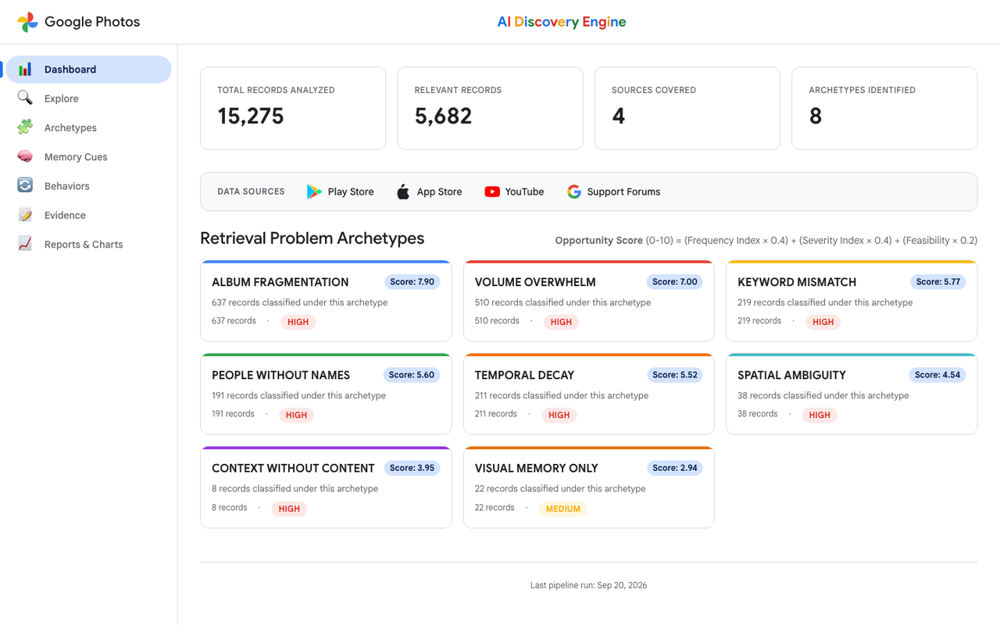
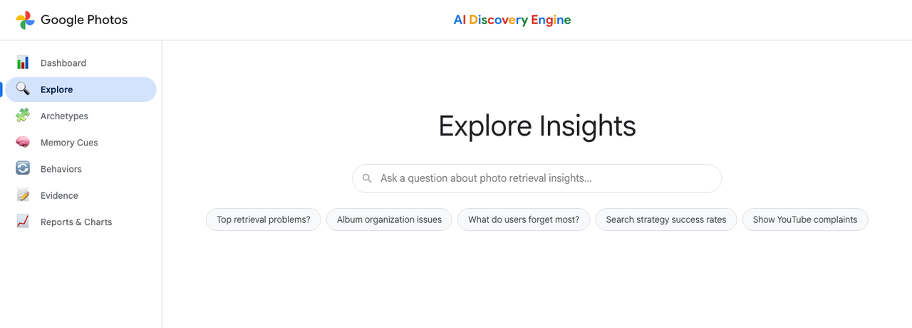
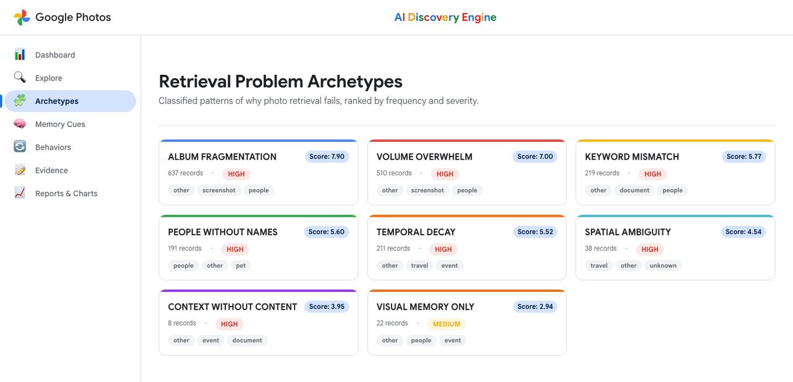
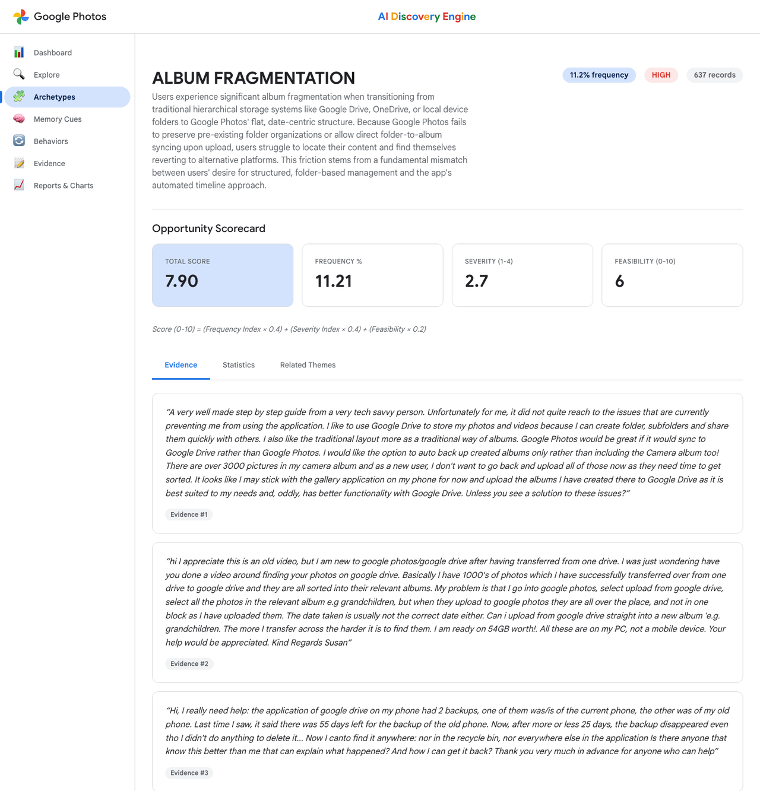
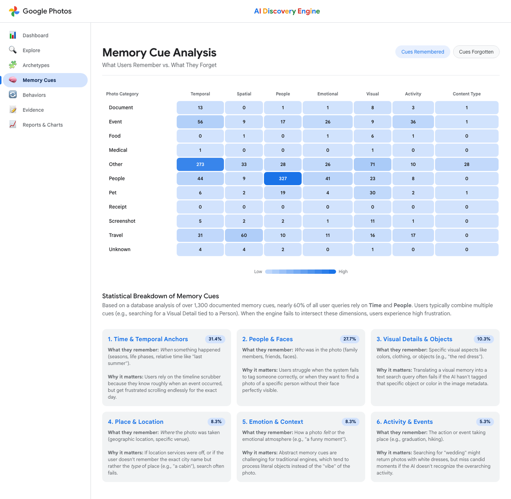
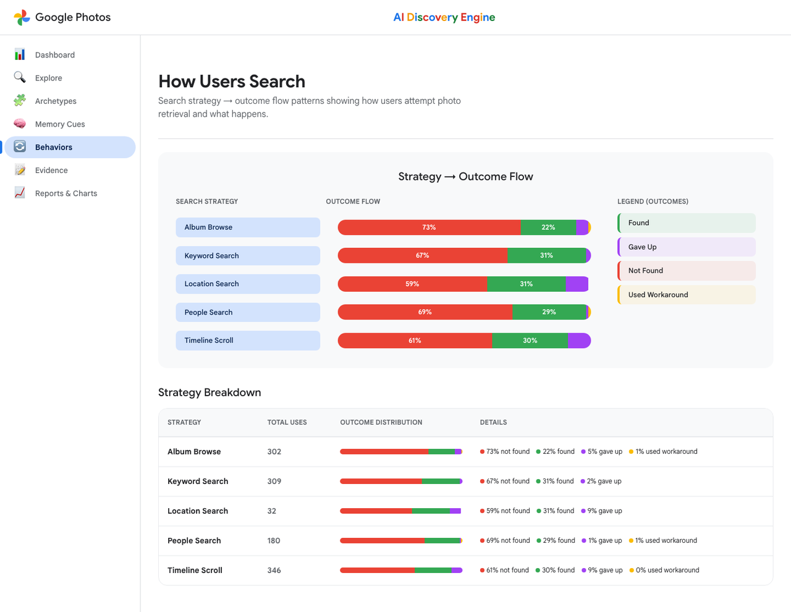
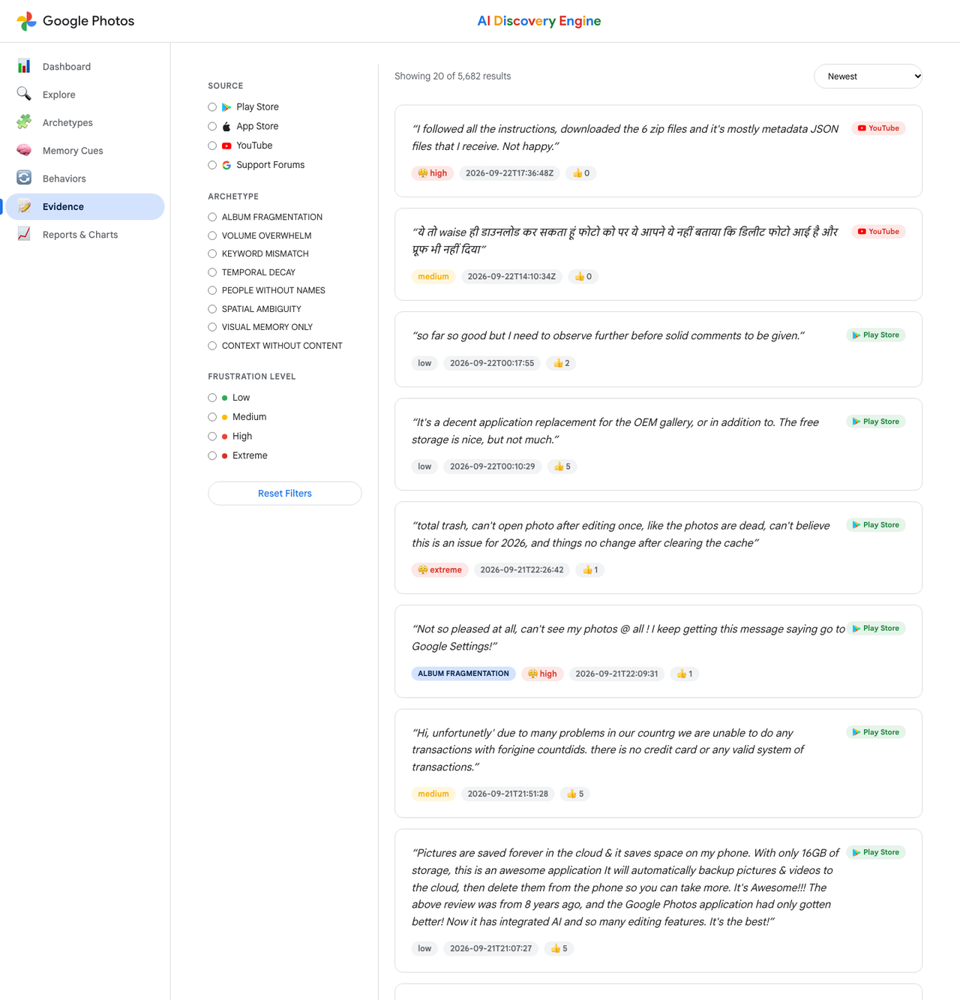
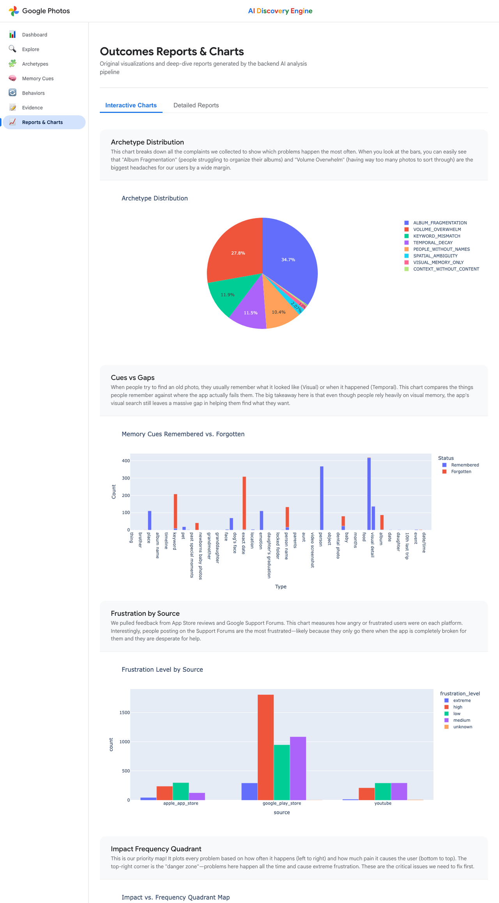

# Google Photos AI Discovery Engine — Full Walkthrough

> **Interactive version:** open [`frontend/public/walkthrough.html`](frontend/public/walkthrough.html) (served at `/walkthrough.html` by the app).
> This file is the GitHub-readable copy of the same tour.

**What it is:** an AI pipeline + dashboard that turns **15,275 public reviews** (Play Store, App Store, YouTube, support forums) into **8 evidence-backed photo-retrieval problem archetypes**, ranked by an opportunity score, with memory-cue analysis, search-behaviour flows, a filterable evidence explorer and a natural-language Q&A.

| 15,275 | 5,682 | 4 | 8 |
|---|---|---|---|
| raw records | relevant records analysed | data sources | problem archetypes |

---

## 1. The problem

Search works when users *know* what to type. Memory is associative and emotional — people remember "that café on the Goa trip" but not the date, place, album or keyword. The goal is to **increase the share of users who retrieve a photo they remember but can't precisely describe when they start searching.** The engine must *understand* how people remember, *identify* where retrieval breaks, *quantify* each problem and *prioritise* opportunities.

## 2. How it works — 9-phase pipeline

Orchestrated by [`src/pipeline_runner.py`](src/pipeline_runner.py) (`--full-run`, `--analysis-only`, `--from <phase>`).

```
15,275 raw  →  6,754 after clean+dedupe  →  5,682 relevant  →  5,012 classified into archetypes
```

| # | Phase | What happens |
|---|---|---|
| 1 | Ingestion | Play Store 9,847 · YouTube 3,559 · App Store 1,850 · Support forums 19 (2016 → Sep 2026) |
| 2 | Clean → dedupe → relevance | LLM relevance filter: 3,676 relevant + 2,006 partial |
| 3 | Metadata enrichment | 16 fields per record: photo category, memory cues remembered/forgotten, strategy, outcome, frustration… |
| 4 | Archetype classification | 8 predefined archetypes (Gemini, Groq variant) |
| 5 | Deep analysis | Sentiment/emotion, 6-stage search journey, emergent themes (BGE embeddings + HDBSCAN) |
| 6 | Correlations & segments | Mutual information / Cramér's V; K-means personas (k = 3) |
| 7 | Root-cause synthesis | Root-cause chains, headline stats, research recommendations |
| 8 | Hybrid RAG stores | SQLite (counts) + ChromaDB (quotes) + LLM query router |
| 9 | Reports, charts, API | Markdown reports, 10 Plotly charts, FastAPI → Next.js |

## 3. The app, page by page

### Dashboard — `/`
KPI cards (records, relevant, sources, archetypes), a data-sources strip, and colour-coded archetype cards ranked by **Opportunity Score = (Frequency × 0.4) + (Severity × 0.4) + (Feasibility × 0.2)**.



### Explore — `/explore`
Google-style search bar with suggestion chips. Questions are routed to SQLite (quantitative), ChromaDB (qualitative) or both (hybrid) and synthesised by Gemini, with source badges and a confidence score.



### Archetypes — `/archetypes`
All 8 archetypes with score, records, severity and top photo categories.



### Archetype detail — `/archetypes/{id}`
Opportunity scorecard (score, frequency, severity, feasibility) plus **Evidence** (verbatim quotes), **Statistics** and **Related Themes** tabs.



### Memory Cues — `/memory-cues`
Heat-map of 7 cue types × 11 photo categories, toggled between **remembered** and **forgotten**. Time 31.4% · People 27.7% · Visual 10.3% · Place 8.3% · Emotion 8.3% · Activity 5.3%.



### Behaviors — `/behaviors`
Strategy → outcome flows for Album Browse, Keyword, Location, People and Timeline search. Every strategy fails more than it succeeds (59–73% not found).



### Evidence — `/evidence`
All 5,682 real user quotes. Filter by source, archetype and frustration level; sort by newest, most engaged or highest frustration.



### Reports & Charts — `/reports`
10 interactive Plotly charts (each with a plain-English explanation) and 4 detailed reports.



## 4. Archetype ranking (live API values)

| # | Archetype | Records | Severity | Score |
|---|---|---|---|---|
| 1 | Album Fragmentation | 637 (11.2%) | HIGH | **7.90** |
| 2 | Volume Overwhelm | 510 (9.0%) | HIGH | **7.00** |
| 3 | Keyword Mismatch | 219 (3.9%) | HIGH | **5.77** |
| 4 | People Without Names | 191 (3.4%) | HIGH | **5.60** |
| 5 | Temporal Decay | 211 (3.7%) | HIGH | **5.52** |
| 6 | Spatial Ambiguity | 38 (0.7%) | HIGH | **4.54** |
| 7 | Context Without Content | 8 (0.1%) | HIGH | **3.95** |
| 8 | Visual Memory Only | 22 (0.4%) | MEDIUM | **2.94** |

## 5. Key findings

- **69.8%** of users with a known outcome failed to find their photo (1,612 not found vs 718 found).
- **46%** of relevant feedback shows high or extreme frustration (2,259 + 356 of 5,682); anger is the top emotion.
- Album Fragmentation + Volume Overwhelm ≈ **20%** of all feedback and top the opportunity ranking.
- Every search strategy fails more often than it succeeds: album browse 73%, people 69%, keyword 67%, timeline 61%, location 59% not found.
- Failure is driven most by frustration level (0.57), search strategy (0.34), sentiment and journey stage (0.25).
- Personas: *Frustrated Searcher* 42.2% · *Mild Searcher* 49.2% · *Refine-stage Strugglers* 8.6%.

## 6. Reports & charts

Charts: `archetype_distribution`, `cues_vs_gaps`, `frustration_by_source`, `impact_frequency_quadrant`, `memory_cue_heatmap`, `search_strategy_sankey`, `source_coverage`, `theme_clusters_umap`, `sentiment_analysis`, `word_cloud` — in [`reports/charts/`](reports/charts/).

Reports: [Opportunity Matrix](reports/opportunity_matrix.md) · [Archetype Report](reports/archetype_report.md) · [Emergent Themes](reports/emergent_themes_report.md) · [Memory Cue Analysis](reports/memory_cue_analysis.md) · [Validation Report](reports/validation_report.md) · [Example Q&A sessions](reports/example_qa_sessions.md)

## 7. Tech stack & API

**Pipeline/AI:** Python, Gemini, Groq, BGE embeddings, HDBSCAN, UMAP (chart), K-means, scikit-learn, Plotly · **Data/RAG:** SQLite, ChromaDB, LLM router · **App:** Next.js 16, React 19, SWR, FastAPI, Railway, Vercel.

| Method | Endpoint | Powers |
|---|---|---|
| GET | `/api/v1/stats` | Dashboard KPIs |
| GET | `/api/v1/archetypes`, `/{id}` | Archetype grid & detail |
| GET | `/api/v1/themes` | Related themes |
| GET | `/api/v1/memory-cues` | Memory-cue heat-map |
| GET | `/api/v1/behaviors` | Strategy → outcome flows |
| GET | `/api/v1/evidence` | Evidence explorer |
| GET | `/api/v1/charts/{name}` | Chart data |
| POST | `/api/v1/query` | Hybrid RAG Q&A (rate-limited) |
| GET | `/health` | Health check |

Live API docs: <https://web-production-1f3c6.up.railway.app/docs>

## 8. Run it

```bash
python3 -m venv venv && source venv/bin/activate
pip install -r requirements.txt            # .env: GOOGLE_API_KEY, YOUTUBE_API_KEY
python src/pipeline_runner.py --analysis-only
uvicorn src.api.main:app --reload --port 8000

cd frontend && npm install && npm run dev  # http://localhost:3000
```
