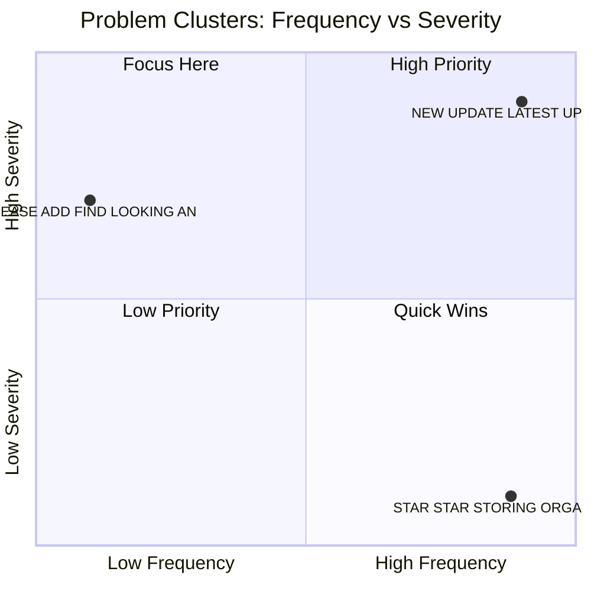

# Opportunity Prioritization Matrix

## Frequency vs. Severity Quadrant Map (Dynamic Problem Clusters)

## Prioritized Archetypes

**Opportunity Score (0-10) = (Frequency Index × 0.4) + (Severity Index × 0.4) + (Feasibility × 0.2)**

Frequency Index = frequency % ÷ highest archetype frequency % × 10; Severity Index = avg severity (1-4) ÷ 4 × 10; Feasibility = 0-10 (10 = easy fix).

| Priority | Archetype | Score | Frequency (%) | Severity (1-4) | Feasibility (0-10) | Rationale |
|---|---|---|---|---|---|---|
| **P0** | ALBUM_FRAGMENTATION | **7.90** | 11.21 | 2.7 | 6.0 | Google Photos completely lacks folder-to-album preservation during uploads, forcing a painful transition for users accustomed to hierarchical storage, which represents a massive experience gap. While technically feasible to map directory structures to albums upon upload, it presents challenges regarding cloud-device sync logic and cross-platform consistency. |
| **P1** | VOLUME_OVERWHELM | **7.00** | 8.98 | 2.8 | 5.0 | Google Photos handles basic chronological scrolling well, but completely breaks down when users need to manage, filter, and organize massive volumes of heterogeneous media like screenshots and extensive custom albums due to flat hierarchies and limited multi-select filtering. |
| **P1** | KEYWORD_MISMATCH | **5.77** | 3.85 | 2.8 | 8.0 | Keyword and semantic search mismatches frequently cause high user frustration in Google Photos, representing a significant experience gap. While modern embedding models and LLMs improve query matching, resolving deep semantic misalignment with user intent remains complex, making feasibility moderate. |
| **P2** | PEOPLE_WITHOUT_NAMES | **5.60** | 3.36 | 2.6 | 9.0 | Google Photos has robust face grouping, but struggles significantly with nuanced family resemblances and lacks intuitive bulk-correction tools. Providing export/backup for metadata to prevent fear of data loss is moderately feasible, though improving edge-case facial recognition accuracy remains complex. |
| **P2** | TEMPORAL_DECAY | **5.52** | 3.71 | 2.7 | 7.5 | Google Photos struggles with deep temporal decay and metadata inconsistencies, making older media hard to find. While search and AI have improved, handling timezone discrepancies and maintaining predictable chronological structures requires complex algorithmic adjustments rather than a simple quick fix. |
| **P2** | SPATIAL_AMBIGUITY | **4.54** | 0.67 | 2.6 | 8.5 | Google Photos excels at AI-based visual search and approximate location estimation, but completely lacks metadata for migrated legacy photos remains a major friction point. While advanced AI estimation and clustering help bridge the experience gap, fully resolving historical context without user input presents a moderate technical challenge. |
| **P3** | CONTEXT_WITHOUT_CONTENT | **3.95** | 0.14 | 2.5 | 7.0 | Google Photos currently lacks robust bulk file management, custom export renaming, and deep context traceability, creating a notable usability barrier. While technically feasible, implementing these features requires substantial UI updates across platforms and adjustments to metadata handling in cloud storage. |
| **P3** | VISUAL_MEMORY_ONLY | **2.94** | 0.39 | 2.0 | 4.0 | Google Photos has advanced computer vision and visual search capabilities, but it still struggles significantly with organizing unstructured legacy and scanned photos that completely lack chronological or contextual metadata, often forcing users into manual organization despite AI assistance. |
